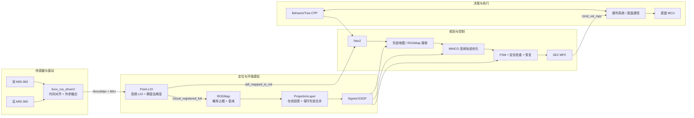

<div align="center">

# BIT RoboMaster Sentry Navigation

### 面向 RoboMaster 哨兵的 ROS 2 感知 · 规划 · 控制 · 决策系统

[](https://docs.ros.org/en/humble/)
[](https://releases.ubuntu.com/22.04/)
[](LICENSE)
[](https://www.robomaster.com/)
[](https://isocpp.org/)
[](src/perception/rog_map)
[](src/perception/rog_map)
[](src/navigation/minco_planner)
[](src/navigation/minco_controller)

**[系统架构](#系统架构) · [功能亮点](#功能亮点) · [安装](#安装与构建) · [硬件配置](#上车前关键配置) · [启动](#启动系统) · [参数索引](#关键参数索引)**

</div>

> [!IMPORTANT]
> 本仓库是北京理工大学追梦战队 2026 赛季哨兵导航工程。配置包含特定车辆的 IP、外参、地图原点和比赛参数，不能未经标定直接用于另一台机器人。首次上车前请完整阅读[上车前关键配置](#上车前关键配置)。

## 🏠 项目简介

本项目面向 RoboMaster 复杂地形、动态对抗和高速全向运动场景，在 ROS 2 Humble 上构建了从激光雷达输入到比赛决策的完整自主导航闭环：

```text
双 Livox MID-360 → Point-LIO → ROGMap → 全局搜索 / MINCO → SE(2) MPC → 底盘
                                      ↑                         ↑
                              Nav2 + 先验地图             行为树 + 裁判系统
```

系统以 Point-LIO 高频里程计和稠密去畸变点云为感知基础，通过 ROGMap 维护滑动三维概率占据地图、地形语义投影和 Signed ESDF；规划端提供 `PRIORMAP` 与 `EXPLORATION` 双模式，将离散路径连续化为满足运动约束的 MINCO 轨迹；控制端使用速度层 SE(2) MPC 跟踪轨迹，并由 FSM、安全检查和 ESDF 梯度恢复构成异常闭环。比赛策略由 BehaviorTree.CPP 管理，通信节点连接裁判系统和底盘。

### 当前实车基线

| 项目 | 当前配置 |
|---|---|
| 操作系统 | Ubuntu 22.04 |
| ROS | ROS 2 Humble |
| 计算平台 | Intel NUC 13，Core i5-1340P，32 GB RAM |
| 激光雷达 | 2 × Livox MID-360，驱动侧融合 |
| 底盘 | 全向底盘；控制器输出世界坐标系速度 |
| ROGMap | `0.05 m` 分辨率，`10 × 10 × 1.5 m` 滑动窗口 |
| 规划 | `PRIORMAP`，20 Hz MINCO 优化配置 |
| 控制 | 100 Hz Nav2 controller server，MPC 预测时域 0.5 s |

## 🧭 系统架构



### 主要数据流

| 来源 | 输出 | 消费者 | 作用 |
|---|---|---|---|
| `livox_ros_driver2` | `/livox/lidar` | Point-LIO | 双雷达融合后的 CustomMsg 点云 |
| `livox_ros_driver2` | `/livox/imu_<ip>` | Point-LIO | 选定主雷达的 IMU |
| Point-LIO | `/aft_mapped_to_init` | Nav2、ROGMap、planner、controller | 位姿、体轴速度和角速度 |
| Point-LIO | `/cloud_registered_full` | ROGMap | 世界系稠密去畸变点云 |
| Point-LIO | `/cloud_registered` | Nav2 STVL | 常规配准点云 |
| ROGMap | 进程内 `MapQueryInterface` | MincoPlanner | 在线投影与保守先验合并后的占据、投影、ESDF 连续查询 |
| MincoPlanner | `/opt_path` | MincoMpcController | planner 发布的优化轨迹，包含 P/V/A/J/Yaw 前馈 |
| MincoMpcController | `/cmd_vel_mpc` | communication / 底盘 | MPC 发布的世界坐标系速度控制话题 |
| bt_manager | Nav2 action / blackboard | Nav2、communication | 比赛策略和状态切换 |

### 技术路径与性能路径

本仓库文档把“算法如何工作”和“系统如何保持实时”分开描述：

| 模块 | 技术方向 | 性能方向 |
|---|---|---|
| Livox Driver | 双雷达按时间窗配对、`back → front` 外参融合 | 同容器、`UniquePtr` 移动发布，避免大消息内部复制 |
| Point-LIO | 预处理 → IMU 传播/去畸变 → 2 ms batch → iVox KNN → ESIKF | 定位点降采样、完整云独立链路、传感器时间 odom 限频、运行时 CSV |
| ROGMap | raycast 概率占据 → 单柱投影 → 保守先验融合 → Signed ESDF | latest-state QoS、dirty column、可选并行 raycast、进程内查询、分阶段 CSV |
| MincoPlanner | A*/SMAC → 局部裁剪 → 稀疏化 → 梯形/三角加减速 → MINCO | 限制前视与控制点规模、latest-state odom、可视化限深度、规划 CSV |
| MincoMpcController | 参考构造 → 补偿 → 凝聚 QP → 速度输出 | 30 维控制量 QP、latest-state odom、深度 1 输出、控制 CSV |
| Communication | 世界系速度/行为指令 → 姿态对齐 → 协议打包 | 独立 callback group、10 ms timer、可选串口/时间匹配 CSV |
| BT Manager | 裁判/状态 → blackboard → 响应式策略树 | 10 Hz tick、状态转移日志、transient-local 区域 Marker |

各模块 README 给出对应流程图、流程概述、技术方向、性能方向和当前不足。根 README 只维护跨模块契约，尤其是 QoS、frame、topic 和性能开关。

## ✨ 功能亮点

### ⚡ 1. 双雷达驱动侧融合与进程内传输

- `livox_ros_driver2` 在驱动侧按雷达 IP 区分前后雷达，通过 `merge_extrinsic_back_to_front` 将后雷达点变换到前雷达坐标系并做时间窗口融合。
- Livox driver 与 Point-LIO 运行在同一 `component_container_mt`，开启 `use_intra_process_comms`；Point-LIO 使用 `UniquePtr` 接收点云，稠密点云也以 `std::unique_ptr` 移交发布，减少大消息复制与跨进程序列化。
- 支持单 MID-360 和双 MID-360 两套 launch；比赛默认使用双雷达入口。

### 🌐 2. Point-LIO 稠密去畸变与可迁移盲区中心

- 保留 Point-LIO 的高带宽点级 LIO，并输出按时间处理、去畸变并变换到 `camera_init` 的 `/cloud_registered_full`。
- `preprocess.blind_center` 将盲区球心从雷达原点移动到机器人关注中心，避免双雷达融合后仍围绕单雷达原点裁剪近场点。
- 稠密点按时间戳进入有序队列，结合前后状态快照做分段前向运动补偿；过期、乱序和非有限点会被丢弃并计数，输出前统一变换到 `camera_init`。
- `/cloud_registered_full` 使用 `SensorDataQoS().keep_last(1)`，让 ROGMap 优先消费最新帧，避免高负载时旧点云排队累积延迟。
- 雷达回调与 LIO 处理线程解耦；定位更新按当前 `2 ms` 时间窗 batch 处理，点云输入、odom 发布、EKF/iVox 和队列统计由总开关控制。
- `/Laser_map` 支持按 `accumulated_map_publish_hz` 低频发布累计地图。

### 🗺️ 3. ROGMap 滑动中心、动态遗忘与地形语义

- 三维概率占据通过 hit/miss 更新抑制瞬时噪声，并用 `keep_time → clear_time` 时间窗清除动态障碍残影。
- `map_sliding.center_offset` 允许地图滑窗中心跟随机器人几何中心，而不是固定围绕 LIO 原点。
- ProjectionLayer 根据单个 XY 柱内的占据高度跨度和垂直占据率，输出 `FREE / PASSABLE / OCCUPIED / UNKNOWN` 四类地形语义。
- ProjectionLayer 支持保守先验合并：将 Nav2 YAML/PGM 先验地图变换到在线投影坐标系，先验中的占据栅格强制并入融合结果；该过程只增加硬障碍，不会用先验 free 清除在线障碍。
- dirty-column 增量刷新、可选并行 Raycasting 和进程内地图查询减少全量遍历与 ROS 消息往返；当前比赛 YAML 默认关闭并行 raycast。
- Signed ESDF 提供障碍外正距离、障碍内负距离和连续梯度，供搜索、优化和恢复共同使用。

### 🛤️ 4. PRIORMAP / EXPLORATION 双模式 MINCO 规划

- `PRIORMAP`：利用 Nav2 先验地图完成全局引导，ROGMap 负责局部动态约束和 ESDF 代价。
- `EXPLORATION`：不依赖先验地图，直接在 ROGMap 有效边界内搜索。
- 前端支持 Costmap 与 ROGMap ESDF 势场融合的 SMAC 风格搜索；中间层完成局部裁剪、视线稀疏化和角点修复。
- 后端联合优化 MINCO 控制点与段时间，以软代价表达位置安全、速度、加速度和路径吸引，并在发布前做离散硬校验；当前热启动包含实车跟随问题下的工程折中，详见 Planner README。

### 🎯 5. SE(2) MPC 与安全恢复闭环

- 状态为 `[x, y, yaw]`，控制为 `[vx, vy, omega]`，使用 qpOASES 求解凝聚 QP。
- 支持控制延迟补偿、杆臂补偿、速度/加速度边界、死区和 Nav2 speed limit。
- 规划 FSM 管理初始化、待命、规划、跟踪、急停与恢复；ESDF 梯度为受困状态生成恢复方向。
- 控制器输出为世界坐标系速度，适配战队底盘 MCU 的全局到本地二次映射。

### 🌳 6. 比赛行为树与通信

- BehaviorTree.CPP XML 定义比赛策略，通过共享 blackboard 管理战术模式、目标点、姿态、小陀螺和裁判状态。
- communication 节点负责串口/网络链路和底盘控制指令，保持导航、决策与电控边界清晰。
- 提供行为树转移日志、区域 Marker 和比赛状态可视化。

## 📦 仓库结构

```text
2027-sentry-navi/
├── src/
│   ├── decision/
│   │   └── bt_manager/              # 行为树、比赛策略、blackboard
│   ├── navigation/
│   │   ├── communication/           # 裁判系统与底盘通信
│   │   ├── minco_controller/        # Nav2 SE(2) MPC controller plugin
│   │   ├── minco_planner/           # 搜索、MINCO、FSM、安全恢复
│   │   └── navi2_bringup/           # Nav2 launch、地图、参数、RViz
│   ├── perception/
│   │   ├── Point-LIO/               # ROS 2 Point-LIO 与稠密点云输出
│   │   ├── livox_ros_driver2/       # Livox SDK2 驱动与双雷达融合
│   │   ├── rog_map/                 # 三维概率地图、投影、Signed ESDF
│   │   └── dbscan_cluster/          # 实验性点云聚类（默认未启用）
│   ├── ros_interfaces/              # 自定义消息
│   └── utils/                       # PCD / PGM / ESDF / 高程等工具
├── scripts/                         # PTP、环境、存图辅助脚本
├── build.bash                       # 受内存预算约束的分阶段构建脚本
├── start.bash                       # 实车完整启动入口
├── play.bash                        # rosbag回放可视化启动脚本
└── CONTRIBUTING.md                  # 贡献规范
```

更深入的模块文档：

- [MincoPlanner](src/navigation/minco_planner/README.md)
- [MincoMpcController](src/navigation/minco_controller/README.md)
- [Communication](src/navigation/communication/README.md)
- [bt_manager](src/decision/bt_manager/README.md)
- [Point-LIO](src/perception/Point-LIO/README.md)
- [ROGMap / Projection / ESDF](src/perception/rog_map/README.md)
- [Livox ROS Driver 2](src/perception/livox_ros_driver2/README.md)
- [CloudLab 点云与地图编辑器](src/utils/pcd_trans/README.md)

## 🛠️ 安装与构建

### 1. 环境要求

- Ubuntu 22.04
- ROS 2 Humble Desktop
- GCC / G++ 与 C++17
- Livox-SDK2
- Nav2、STVL、BehaviorTree.CPP v3、PCL、Eigen3、OpenMP、yaml-cpp、glog、fmt
- 可选：OpenCV（地图工具）

> [!NOTE]
> 仓库已经包含 qpOASES third-party 回退实现。部分包的 `package.xml` 仍未覆盖所有系统依赖，`rosdep` 之后可能仍需按报错安装系统库。

### 2. 安装 ROS 依赖

```bash
# 本仓库以 Humble 为基线；如使用其他 ROS 2 版本，请提前设置 ROS_DISTRO
export ROS_DISTRO="${ROS_DISTRO:-humble}"
source "/opt/ros/${ROS_DISTRO}/setup.bash"
sudo apt update
sudo apt install -y \
  python3-colcon-common-extensions python3-rosdep \
  libeigen3-dev libpcl-dev libyaml-cpp-dev libgoogle-glog-dev \
  libunwind-dev libfmt-dev libopencv-dev libomp-dev \
  ros-${ROS_DISTRO}-backward-ros \
  ros-${ROS_DISTRO}-pcl-ros \
  ros-${ROS_DISTRO}-pcl-conversions \
  ros-${ROS_DISTRO}-ament-cmake \
  ros-${ROS_DISTRO}-ament-cmake-core \
  ros-${ROS_DISTRO}-ament-cmake-auto \
  ros-${ROS_DISTRO}-behaviortree-cpp-v3 \
  ros-${ROS_DISTRO}-spatio-temporal-voxel-layer \
  ros-${ROS_DISTRO}-nav2-behavior-tree
# 安装仿真资源仓库依赖
sudo apt install ros-humble-ros-gz ignition-fortress libignition-gazebo6-dev
# 安装当前 ROS 2 发行版仓库中所有 nav* / nav2* 二进制包，排除调试符号包
mapfile -t ros_nav_packages < <(
  apt-cache pkgnames \
    | grep -E "^ros-${ROS_DISTRO}-(nav|nav2)" \
    | grep -v -- '-dbgsym$'
)
sudo apt install -y "${ros_nav_packages[@]}"

sudo rosdep init  # 仅首次安装 rosdep 时执行
rosdep update
rosdep install --from-paths src --ignore-src -r -y
```

若 `sudo rosdep init` 提示已初始化，直接继续 `rosdep update`。

### 3. 安装 small_gicp 与 Sophus

`small_gicp` 和 `Sophus` 需要按照各自仓库的源码安装教程安装到系统路径：

- [small_gicp 官方安装教程](https://github.com/koide3/small_gicp#installation)
- [Sophus 官方源码构建说明](https://github.com/strasdat/Sophus#how-to-build-sophus-from-source)

请安装 C++ 版本；不要用同名 Python 包代替。安装完成后再构建本工作空间。

### 4. 安装 Livox-SDK2

按照 [Livox-SDK2 官方说明](https://github.com/Livox-SDK/Livox-SDK2) 安装。典型流程如下：

```bash
git clone https://github.com/Livox-SDK/Livox-SDK2.git
cd Livox-SDK2
mkdir build && cd build
cmake ..
make -j"$(nproc)"
sudo make install
```

### 5. 获取、更新仓库并构建

```bash
git clone --branch develop --single-branch \
  https://github.com/Walker152/navi_minco_bit.git ~/2027-sentry-navi
cd ~/2027-sentry-navi
export ROS_DISTRO="${ROS_DISTRO:-humble}"
source "/opt/ros/${ROS_DISTRO}/setup.bash"
./build.bash
source install/setup.bash
```

已有工作空间更新时，先确认没有未保存的本地修改，再同步 `develop`：

```bash
cd ~/2027-sentry-navi
git fetch personal --prune
git checkout develop
git pull --ff-only personal develop
```

如果本地仍保留旧的 `rog_map_work` 分支，请以 `develop` 为当前开发分支；历史重写或远程分支调整后，协作者应重新克隆工作空间。

`build.bash` 会在 `MEM_LIMIT_GB` 内先串行构建高内存关键包，再并行构建其余包。可按机器内存调整：

```bash
MEM_LIMIT_GB=24 MEM_PER_WORKER_GB=2 ./build.bash
```

> [!WARNING]
> `start.bash` 当前固定执行 `cd ~/2027-sentry-navi`，若工作空间位于其他目录，请先修改该行。脚本还会打开多个 GNOME Terminal、启动 PTP sudo 命令并自动录制 rosbag，更适合实车桌面环境，不适合无界面服务器。

## ⚙️ 上车前关键配置

以下四组配置存在耦合。建议按“网络 → 双雷达外参 → LIO/TF → 规划控制/ROGMap”的顺序标定。

### 1. Livox 主机 IP、雷达 IP 与双雷达融合

关键文件：

- `src/perception/livox_ros_driver2/config/mixed_MID360_config.json`
- `src/perception/livox_ros_driver2/config/mixed_MID360_component.yaml`
- 单雷达对应 `MID360_config.json` 与 `single_MID360_component.yaml`

当前双雷达基线：

```yaml
# mixed_MID360_config.json
host_net_info: 192.168.1.47       # NUC 有线网卡地址
lidar_configs:
  - 192.168.1.122                 # 后雷达
  - 192.168.1.135                 # 前雷达 / IMU 来源

# mixed_MID360_component.yaml
enable_internal_lidar_merge: true
merge_front_ip: 192.168.1.135
merge_back_ip: 192.168.1.122
merge_output_topic: livox/lidar
merge_max_interval_ms: 5.0
merge_extrinsic_back_to_front: [0.0, 0.4, 0.0, -0.35453, 0.0, 0.0]
```

配置原则：

1. 将 NUC 网卡设置为与雷达同网段的静态地址，并同步修改 JSON 中所有 `host_net_info.*_ip`。
2. `lidar_configs[].ip` 必须与雷达实际 IP 一致；`merge_front_ip`、`merge_back_ip` 必须引用其中两台雷达。
3. `merge_extrinsic_back_to_front` 表示“后雷达坐标系 → 前雷达坐标系”的刚体外参，数组的具体顺序以驱动实现和当前配置注释为准，重新安装雷达后必须实测标定，不能只修改 IP。
4. Point-LIO 当前订阅 `livox/imu_192_168_1_135`。若更换主雷达 IP，应同步修改 launch 的 `pointlio_imu_topic` 和 `mid360.yaml` 的 `common.imu_topic`。

可先单独检查雷达：

```bash
source install/setup.bash
ros2 launch livox_ros_driver2 msg_mixed_MID360.launch.py
ros2 topic list | grep livox
ros2 topic hz /livox/lidar
```

### 2. Point-LIO 外参、blind 中心与坐标系发布

关键文件：

- `src/perception/Point-LIO/config/mid360.yaml`
- `src/perception/Point-LIO/src/laserMapping.cpp`

当前相关参数：

```yaml
preprocess:
  blind: 0.35
  blind_center_enable: true
  blind_center: [0.0, 0.20, 0.0]

mapping:
  extrinsic_est_en: false
  extrinsic_T: [-0.011, -0.02329, 0.04412]
  extrinsic_R: [1.0, 0.0, 0.0,
                0.0, 1.0, 0.0,
                0.0, 0.0, 1.0]

publish:
  tf_send_en: true
```

`blind_center` 位于输入点云坐标系。启用后，近场裁剪使用点到该中心的距离，而不是点到雷达原点的距离。当前 `[0, 0.20, 0]` 与车辆几何中心偏置配套；更换雷达参考原点或车体定义时应一起重算。

当前 `laserMapping.cpp` 的坐标系发布是源码固定逻辑：

| 输出 | parent / frame | child | 说明 |
|---|---|---|---|
| `/aft_mapped_to_init` | `camera_init` | `body` | LIO odometry |
| `/cloud_registered[_full]` | `camera_init` | — | 世界系配准点云 |
| TF | `camera_init` | `body` | 完整 LIO 姿态 |
| TF | `camera_init` | `base_link` | 当前只发布 yaw 平面姿态，并加 `[0, 0.20, 0]` 平移偏置 |

> [!CAUTION]
> `camera_init → base_link` 的 `offset_vec(0.0, 0.20, 0.0)` 当前硬编码在 `laserMapping.cpp`，不是 `mid360.yaml` 参数。修改车辆几何时，必须同步检查它与 `blind_center`、ROGMap `center_offset`、planner/controller `lidar_offset_*` 的定义；不要额外启动同名静态 TF，否则会产生重复 TF 发布者。

### 3. Planner 与 Controller 杆臂补偿

关键文件：`src/navigation/navi2_bringup/params/sentry1.yaml`。

```yaml
planner_server:
  ros__parameters:
    MincoPlanner:
      lidar_offset_x: 0.0
      lidar_offset_y: -0.20

controller_server:
  ros__parameters:
    FollowPath:
      lidar_offset_x: 0.0
      lidar_offset_y: -0.20
      lidar_roll_offset: 0.1745
```

`lidar_offset_x/y` 表示杆臂向量，参与 `v_body = v_lidar + ω × r` 的速度补偿。当前 planner 与 controller 都配置为 `[0, -0.20]`，两处必须保持一致，否则规划初始速度与控制状态会来自不同参考点。符号不能仅凭机械图猜测，应结合源码公式、坐标轴方向和旋转实测确认：原地旋转时，补偿后的底盘旋转中心平移速度应接近零。

`lidar_roll_offset` 仅在 controller 中用于安装滚转相关处理；它不是二维杆臂长度，也不应与 Point-LIO 的 `mapping.extrinsic_R` 混为一谈。

推荐检查：

```bash
ros2 param get /planner_server MincoPlanner.lidar_offset_x
ros2 param get /planner_server MincoPlanner.lidar_offset_y
ros2 param get /controller_server FollowPath.lidar_offset_x
ros2 param get /controller_server FollowPath.lidar_offset_y
```

### 4. ROGMap 中心、Z 窗口与雷达安装高度

关键文件：`src/navigation/navi2_bringup/params/sentry1.yaml` 的 `planner_server.ros__parameters.MincoPlanner.rog_map`。

```yaml
rog_map:
  frame_id: camera_init
  resolution: 0.05
  map_size: [10.0, 10.0, 1.5]

  map_sliding:
    center_offset_enable: true
    center_offset: [0.0, 0.20, 0.0]

  projection:
    scan_z_min_abs: -0.20
    scan_z_max_abs: 1.50
    surface_height_delta_max: 0.10
    wall_height_delta_min: 0.20
    tunnel_height_delta_min: 0.25
    tunnel_height_delta_max: 0.40
```

`center_offset` 是 ROGMap frame 中的滑动窗口中心偏置。它控制地图窗口围绕哪里滑动，不会自动修改传感器原点、点云坐标或 planner 杆臂参数。当前值与 `base_link` 相对 LIO 原点的正向偏置一致。

`scan_z_min_abs` 与 `scan_z_max_abs` 是 `camera_init` 中的**绝对 Z 坐标**，不是离地高度。若初始化后 `camera_init` 的 Z 原点近似位于雷达高度，雷达离地高度为 `h_lidar`，希望扫描地面以上 `[h_min, h_max]` 的空间，则可用：

```text
scan_z_min_abs ≈ h_min - h_lidar
scan_z_max_abs ≈ h_max - h_lidar
```

例如雷达离地 `0.45 m`，希望覆盖离地 `0.05–1.50 m`，初值可设为 `[-0.40, 1.05]`。这只是几何初值；最终必须在 RViz 中用 `/rog_map/occupied`、`/rog_map/layer_height_delta` 和 `/rog_map/layer_type` 验证。

同时满足以下关系：

- `map_size.z` 应覆盖 `[scan_z_min_abs, scan_z_max_abs]` 及车辆运动、坡道和定位波动余量；窗口不足会截断投影输入。
- `surface_height_delta_max < wall_height_delta_min`。
- `tunnel_height_delta_min` 应大于机器人实际高度加安全余量，且不大于 `tunnel_height_delta_max`。
- 调整雷达安装高度时，优先重新推导绝对 Z 扫描上下界；不要用改 hit/miss 概率补偿错误的高度窗口。

> [!WARNING]
> 当前基线的投影请求跨度为 `1.50 - (-0.20) = 1.70 m`，大于配置的 `map_size.z = 1.50 m`。源码会把投影 Z 索引裁剪到当前滑动地图边界，因此实际参与投影的是二者交集，而不是完整的 `[-0.20, 1.50]`。更换雷达高度或希望完整覆盖该区间时，应同时调整 Z 窗口尺寸/中心与扫描上下界，并评估额外内存和计算量。

### 配置一致性清单

| 物理量 | 配置位置 | 当前值 | 一致性要求 |
|---|---|---:|---|
| 前雷达 IP | Livox JSON/YAML、Point-LIO IMU topic | `192.168.1.135` | 三处同步 |
| 后雷达 IP | Livox JSON/YAML | `192.168.1.122` | 两处同步 |
| 近场关注中心 | `Point-LIO preprocess.blind_center` | `[0, 0.20, 0]` | 与参考中心定义一致 |
| LIO 到底盘中心 TF | `laserMapping.cpp offset_vec` | `[0, 0.20, 0]` | 与实际安装一致 |
| ROGMap 滑窗中心 | `rog_map.map_sliding.center_offset` | `[0, 0.20, 0]` | 与希望覆盖的车体中心一致 |
| 速度杆臂 | planner/controller `lidar_offset_*` | `[0, -0.20]` | 两插件同值；符号按公式验证 |

## 🚀 启动系统

### 1. 分模块启动（推荐首次上车）

每个终端都先执行：

```bash
cd ~/2027-sentry-navi
export ROS_DISTRO="${ROS_DISTRO:-humble}"
source "/opt/ros/${ROS_DISTRO}/setup.bash"
source install/setup.bash
```

启动双雷达与 Point-LIO：

```bash
ros2 launch point_lio mixed_livox_pointlio_intra_process.launch.py
```

启动 Nav2、ROGMap、MINCO 与 MPC：

```bash
ros2 launch navi2 navigation2.launch.py
```

启动比赛决策和通信：

```bash
ros2 launch bt_manager bt_manager.launch.py
ros2 launch communication com.launch.py
```

### 2. 一键实车启动

完成所有标定并确认急停链路后：

```bash
bash start.bash
```

脚本依次启动：

1. PTP 时间同步；
2. 双雷达 + Point-LIO component container；
3. Nav2 + ROGMap + MincoPlanner + MincoMpcController；
4. bt_manager；
5. communication；
6. 指定 topics 的 rosbag 记录。

`start.bash` 会请求 sudo 并向底盘链路发送控制数据，上车前应架空轮组或保证机械急停可用。

### 3. 单雷达模式

```bash
ros2 launch point_lio single_livox_pointlio_intra_process.launch.py
```

使用前同步检查 `single_MID360_component.yaml`、`MID360_config.json` 和 Point-LIO IMU topic。

### 4. 先验地图导航

1. 启动雷达与 Point-LIO，确认 `/aft_mapped_to_init` 和 `/cloud_registered_full` 正常。
2. 准备 Nav2 YAML/PGM 先验地图；需要从已有 PCD 转换时，可使用 `pcd2pgm`、`pcd2esdf` 等工具生成所需先验数据。
3. 修改 `src/navigation/navi2_bringup/launch/navigation2.launch.py` 中默认 map，或运行时覆盖：

   ```bash
   ros2 launch navi2 navigation2.launch.py map:=/absolute/path/to/map.yaml
   ```

4. 若启用 ROGMap 投影层保守先验合并，同步配置 `projection.prior_map.enable`、`yaml_path`、`pgm_path` 和 `frame_id`。
5. `PRIORMAP` 模式确认 `map → camera_init` 初始变换。当前 launch 中存在赛场相关硬编码静态 TF，应按地图原点修改，并确保该 TF 只有一个发布者。
6. 无先验地图时将 `MincoPlanner.planner_mode` 改为 `EXPLORATION`，并重新核对 unknown 策略与 ROGMap 边界。

## 🧩 关键参数索引

所有数值均为当前 `sentry1.yaml` / `mid360.yaml` 基线，不是通用推荐值。

### Point-LIO

| 参数 | 当前值 | 作用 |
|---|---:|---|
| `preprocess.blind` | `0.45 m` | 近场盲区半径 |
| `preprocess.blind_center_enable` | `true` | 使用迁移后的盲区中心 |
| `preprocess.blind_center` | `[0, 0.20, 0]` | 输入点云系中的盲区球心 |
| `mapping.extrinsic_est_en` | `false` | 关闭在线外参估计 |
| `publish.tf_send_en` | `true` | 发布 LIO TF |
| `odometry.publish_odometry_without_downsample` | `true` | 高频状态发布 |
| `pcd_save.accumulated_map_publish_hz` | `1.0` | `/Laser_map` 发布频率 |

### ROGMap

| 参数 | 当前值 | 作用 / 调参影响 |
|---|---:|---|
| `resolution` | `0.05 m` | 基础体素；更小更细但增加内存和计算 |
| `map_size` | `[10,10,1.5] m` | 三维滑动窗口尺寸 |
| `map_sliding.threshold` | `0.2 m` | 触发窗口滑动的位移 |
| `map_sliding.center_offset` | `[0,0.20,0] m` | 滑窗中心相对 LIO 原点偏置 |
| `ros_callback.update_period_ms` | `20 ms` | 地图消费循环周期 |
| `raycasting.ray_range` | `[0.03,10.0] m` | 有效射线范围 |
| `decay.keep_time` | `0.8 s` | hit 后保持占据的最短时间 |
| `decay.clear_time` | `1.2 s` | hit 后强制衰减到 free 的最长时间 |
| `projection.prior_map.enable` | `true` | 启用在线投影与二维先验地图的保守合并 |
| `projection.prior_map.yaml_path` | `first_floor_prior.yaml` | Nav2 先验地图 YAML 路径 |
| `projection.prior_map.pgm_path` | 空 | 留空时使用 YAML 的 `image` 字段 |
| `projection.prior_map.frame_id` | `map` | 先验地图坐标系；通过 TF 对齐 ROGMap 投影 |
| `projection.scan_z_min_abs/max_abs` | `-0.20 / 1.50 m` | ROGMap frame 中绝对 Z 扫描区间 |
| `field.max_distance/min_distance` | `6.0 / -3.0 m` | Signed ESDF 截断范围 |
| `performance.dirty_column_enable` | `true` | 增量刷新 Projection/Field |

### MincoPlanner

| 参数 | 当前值 | 作用 |
|---|---:|---|
| `planner_mode` | `PRIORMAP` | 先验地图 / 探索模式 |
| `lidar_offset_x/y` | `0.0 / -0.20 m` | LIO 速度到车体中心杆臂补偿 |
| `minco_optimizer.opt_freq` | `20 Hz` | 优化目标频率 |
| `lookahead_dist` | `6.0 m` | 局部优化前视距离 |
| `max_velocity` | `3.0 m/s` | 轨迹速度上界 |
| `max_acceleration` | `2.0 m/s²` | 轨迹加速度上界 |
| `safe_dist / collision_dist` | `0.35 / 0.25 m` | 优化安全距离 / 碰撞阈值 |
| `minco_optimizer.penalty_weight_time` | `100.0` | 轨迹总时间惩罚权重 |
| `minco_optimizer.penalty_weight_pos` | `50000.0` | ESDF 位置安全惩罚权重 |
| `minco_optimizer.penalty_weight_vel` | `1500.0` | 速度越界惩罚权重 |
| `minco_optimizer.penalty_weight_acc` | `1500.0` | 加速度越界惩罚权重 |
| `minco_optimizer.penalty_weight_att` | `100.0` | 轨迹对前端路径吸引项权重 |

### MincoMpcController

| 参数 | 当前值 | 作用 |
|---|---:|---|
| `controller_frequency` | `100 Hz` | Nav2 控制服务器频率 |
| `FollowPath.dt` | `0.05 s` | MPC 模型离散周期 |
| `FollowPath.lookahead_time` | `0.5 s` | 预测时域 |
| `FollowPath.control_delay_compensation` | `0.05 s` | 控制链路延迟前推 |
| `FollowPath.lidar_offset_x/y` | `0.0 / -0.20 m` | 控制状态杆臂补偿 |
| `FollowPath.lidar_roll_offset` | `0.1745 rad` | 安装滚转补偿 |
| `FollowPath.vx/vy_min/max` | `±3.0 m/s` | 平移速度约束 |
| `FollowPath.omega_min/max` | `±5.0 rad/s` | 角速度约束 |
| `FollowPath.use_acc_constraints` | `true` | 启用差分加速度约束 |

## 🧱 TF 与坐标系

典型 TF 关系：

```text
map
└── camera_init              # 当前 launch 中配置的全局初始变换
    ├── body                 # Point-LIO 完整姿态
    └── base_link            # 平面导航参考点
```

- `map`：先验全局地图坐标系。
- `camera_init`：Point-LIO 初始化世界坐标系，也是 ROGMap 工作坐标系。
- `body`：LIO/IMU 机体参考。
- `base_link`：Nav2 机器人基座参考。
- `minimap`：裁判系统小地图坐标系；红蓝方变换在 launch 中配置。

如果运行 `tf2_tools view_frames` 或 Foxglove 后发现跳变，优先检查 `map → camera_init` 和 `camera_init → base_link` 是否存在重复发布者，以及时间同步是否正常。

## 📊 点云链路性能改造

点云链路不是简单地“提高发布频率”，而是围绕复制次数、队列时延、去畸变完整性和下游消费方式做端到端优化：

```text
双 MID-360 驱动侧融合
  → 同进程 UniquePtr 传入 Point-LIO
  → 时间有序队列 + 状态快照分段去畸变
  → unique_ptr 发布 /cloud_registered_full（keep_last=1）
  → ROGMap latest-state 消费
  → dirty-column 增量投影 / ESDF 刷新
  → MapQueryInterface 进程内查询 MINCO
```

| 改造点 | 实现 | 主要收益 |
|---|---|---|
| 驱动侧双雷达融合 | 按 IP 和时间窗口完成矩阵变换与合并 | 避免下游重复同步、转换两路点云 |
| ROS 2 component container | Livox driver 与 Point-LIO 同进程，启用 intra-process | 减少大点云序列化与内存搬运 |
| 所有权传递 | Point-LIO 订阅使用 `UniquePtr`，稠密点云用 `std::unique_ptr` 发布 | 为进程内零拷贝/少拷贝路径提供必要条件 |
| 稠密去畸变 | 时间有序队列、状态快照、分段前向补偿、异常点丢弃 | 保留高速与小陀螺场景的完整点云时序 |
| Latest-state QoS | `/cloud_registered_full` 使用 SensorDataQoS、深度 1 | 下游过载时丢旧帧而非积累感知延迟 |
| 发布限频 | `/Laser_map` 与可视化独立低频发布 | 避免累计地图和可视化挤占实时链路 |
| ROGMap 增量更新 | dirty column 只刷新受影响的 Projection/Field 区域 | 减少每帧全图扫描 |
| 进程内地图查询 | planner 直接使用 `MapQueryInterface` | 避免 ESDF/占据栅格通过 ROS 消息复制后再查询 |
| 性能可观测性 | Point-LIO、ROGMap、MINCO、MPC 分层计时与可选 CSV | 定位瓶颈时区分输入、地图、规划和控制耗时 |

> [!NOTE]
> 开启 intra-process 并不自动保证所有路径零拷贝；发布/订阅消息所有权、QoS 兼容性和组件是否处于同一容器同样关键。当前实现通过 UniquePtr 和同容器组合尽量减少点云复制。

## 📡 特殊 QoS 配置

以下只列出源码中显式偏离普通默认队列语义、或对跨模块匹配特别重要的 topic。未列出的接口不代表没有 QoS，需以实际源码和 `ros2 topic info --verbose` 为准。

| Topic / 接口 | 发布 / 订阅侧 | 当前显式 QoS | 设计目的与注意事项 |
|---|---|---|---|
| Livox 点云输入 | Point-LIO 订阅 | `SensorDataQoS` + `UniquePtr` | 低延迟传感器流；Driver publisher 必须与其兼容 |
| Livox IMU 输入 | Point-LIO 订阅 | `SensorDataQoS` | 低延迟 IMU；当前源码未显式扩大 depth |
| `/cloud_registered_full` | Point-LIO 发布、ROGMap 订阅 | `SensorDataQoS().keep_last(1)`；订阅为 `UniquePtr` 且启用 intra-process | 大点云只保留最新帧，过载时丢旧帧 |
| `/aft_mapped_to_init` | Planner、Controller、ROGMap、Communication 订阅 | `KeepLast(1) + best_effort + volatile` | latest-state odom，避免高频历史消息积压 |
| `/opt_path` | Planner 发布 | `KeepLast(1)` | 只保留最近轨迹；Controller 订阅当前为 `SystemDefaultsQoS`，部署时需确认兼容 |
| `/minco_candidate_path_vis`、`/astar_path_vis`、`/minco_control_points_vis` | Planner 发布 | `KeepLast(1) + transient_local` | RViz 后加入仍可取得最近诊断结果 |
| `/opt_path_vis`、`/recover_path`、`/recover_goal` | Planner 发布 | `KeepLast(1)` | 避免可视化历史积压 |
| `/rog_map/*` 可视化 | ROGMap 发布 | `KeepLast(1) + best_effort + volatile` | 调试数据不阻塞地图更新，RViz QoS 需匹配 best-effort |
| `/mpc_predict_path`、`/mpc_real_path`、`/cmd_vel_mpc` | Controller 发布 | 深度 1 | 控制和预测只保留最近结果 |
| `/sentry/area_markers` | BT Manager 发布 | `KeepLast(1) + reliable + transient_local` | 静态/低频区域 Marker 对后加入 RViz 可见 |
| Nav2 静态地图订阅 | costmap/map saver | `map_subscribe_transient_local: true` | 获取 map server 最近发布的持久化地图 |

> [!WARNING]
> best-effort latest-state 适合 odom、点云和高频可视化，不适合必须逐条可靠送达的事件。修改任一端 QoS 前必须同时检查发布者、订阅者和 RViz/Nav2 的兼容性。

## 📈 性能记录开关

实时模块的 CSV 并非统一由一个全局开关控制：

| 模块 | 总开关 | CSV / 默认路径 | 默认状态 |
|---|---|---|---|
| Point-LIO | `runtime_pos_log_enable` | `performance.csv`、IMU/状态日志；目录由 `runtime_log_path` 控制 | 关闭 |
| ROGMap | `MincoPlanner.rog_map.performance.enable`，另有 detailed/summary 子开关 | `/tmp/rog_map_perf_detailed.csv`、`/tmp/rog_map_perf_summary.csv` | 聚合总开关开，CSV 关闭 |
| MincoPlanner | `MincoPlanner.performance.enable` | `/tmp/minco_perf_detailed.csv` | 关闭 |
| MincoMpcController | `FollowPath.performance.enable` | `/tmp/mpc_perf_detailed.csv` | 总开关/打印开启，detailed CSV 关闭 |
| Communication | `communication.enable_performance_diagnostics` | `/tmp/communication_logs/sent_messages_*.csv` | 关闭 |
| BT Manager | 无统一性能 CSV；使用 `bt_debug_*` 转移日志开关 | `logs/bt_transition.log` | 文件日志关闭 |
| Livox Driver | 当前无统一性能 CSV | 使用 topic hz、时间戳和 Point-LIO 输入统计 | — |

开启 detailed CSV 会增加计时、互斥和磁盘 IO。比赛运行时应先用终端 summary 或短时采样定位阶段，再按模块单独打开 CSV。

## 🔭 可视化与运行诊断

### 建议观察的 topics

```bash
ros2 topic hz /aft_mapped_to_init
ros2 topic hz /cloud_registered_full
ros2 topic hz /opt_path
ros2 topic hz /cmd_vel_mpc
```

| Topic | 用途 |
|---|---|
| `/rog_map/occupied` | 三维占据体素 |
| `/rog_map/layer_value` | 二维语义代价值 |
| `/rog_map/layer_type` | 地形类型 |
| `/rog_map/layer_height_delta` | 单柱占据高度跨度 |
| `/rog_map/field` | Signed ESDF 可视化 |
| `/astar_path_vis` | 搜索路径 |
| `/minco_control_points_vis` | MINCO 控制点 |
| `/opt_path_vis` | 优化轨迹 |
| `/mpc_predict_path` | MPC 预测轨迹 |
| `/recover_goal` | ESDF 恢复目标 |

性能统计开关位于 `sentry1.yaml` 的 `performance` 子树。比赛运行时建议只开启必要统计，避免详细 CSV 和高频终端输出影响实时性。

## 🩺 常见问题

<details>
<summary><b>收不到 Livox 点云或 IMU</b></summary>

检查主机静态 IP、雷达 IP、网卡路由与防火墙；确认 JSON 中 host IP 和 lidar IP；再检查 `pointlio_imu_topic` 是否包含当前主雷达 IP。双雷达模式还需确认 `multi_topic: 1` 和 merge 前后 IP。

</details>

<details>
<summary><b>原地旋转时估计出明显平移速度</b></summary>

优先检查时间同步、双雷达外参和 Point-LIO 外参，再检查 planner/controller 的 `lidar_offset_x/y` 是否一致且符号正确。用架空轮组的低速原地旋转数据验证，不要直接在高速小陀螺状态试错。

</details>

<details>
<summary><b>ROGMap 看不到地面、墙体被截断或地形分类异常</b></summary>

检查 `/cloud_registered_full` 的 frame 和 Z 范围；按雷达安装高度重新计算 `scan_z_min_abs/max_abs`；确认 `map_size.z` 能覆盖扫描窗口。高度窗口正确后再调整地形差值和占据率阈值。

</details>

<details>
<summary><b>Nav2 报 TF 重复或轨迹跳变</b></summary>

检查 `navigation2.launch.py` 的静态 `map → camera_init`、Point-LIO 的 `tf_send_en`，并确认没有额外发布 `camera_init → body/base_link` 的静态节点。

</details>

<details>
<summary><b>启动脚本找不到工作空间或无法在 SSH 中运行</b></summary>

`start.bash` 固定进入 `~/2027-sentry-navi` 并依赖 `gnome-terminal`。修改工作空间路径，或按“分模块启动”在当前 shell / tmux 中运行各 launch。

</details>

## ⚠️ 当前限制

- 当前配置与 launch 包含实车 IP、雷达外参、地图路径、红蓝方小地图 TF 和赛场初始位姿，尚未抽象成通用硬件 profile。
- `camera_init → base_link` 平移偏置仍在 Point-LIO 源码中硬编码，车辆几何参数尚未完全统一到 YAML。
- `start.bash` 假设 GNOME 桌面、固定工作空间路径和可用 sudo，不是通用服务管理器。
- 仓库包含比赛验证逻辑和实验性模块；`dbscan_cluster`、部分恢复/裁剪分支默认未启用。
- Planner 为补偿电控速度稳态跟踪误差，在误差门控超限时仍强制使用热启动速度/加速度；热启动位置取 odom，而不是旧轨迹期望位置，P/V/A 边界状态来源不一致。
- 主 MINCO 优化没有安全走廊硬约束，总代价上限门控当前停用；ESDF/动力学为软代价，发布前采样校验只能拒绝候选，不能阻止极端情况下先产生畸形数值解。
- 动态避障响应受点云/ROGMap 刷新、FSM 触发、旧轨迹复用和新轨迹接受共同影响，当前现场表现仍不够灵敏。
- ROGMap ProjectionLayer 依赖雷达安装位置与地面点云覆盖，尚未实现坡面分割；堡垒与普通坡面的区分仍依赖先验地图和场景参数。
- Point-LIO 的 2 ms batch 降低 ESIKF 更新频率，但 iVox KNN 仍按 batch 内点执行；DEFAULT 线性节点、体素点密度和邻域范围可能形成搜索瓶颈，当前还缺逐 KNN 延迟分布。

## 🤝 安全与贡献

这是会控制真实竞赛机器人的软件。修改速度、加速度、TF、外参、QoS、控制频率或恢复策略后，请依次完成静态检查、离线回放、架空轮测试、低速空场测试，再进入对抗环境。

提交 issue 或修改前请阅读 [CONTRIBUTING.md](CONTRIBUTING.md) 和 [AGENTS.md](AGENTS.md)。不要在未验证的情况下改变比赛参数、topic、frame、blackboard key 或行为树优先级。

## 🙏 致谢与参考

本项目建立在以下优秀开源工作之上：

- 哈尔滨工业大学（威海）[刘谨博](https://github.com/LiuJinbo1027)

- [ROS 2](https://docs.ros.org/en/humble/) 与 [Navigation2](https://github.com/ros-navigation/navigation2)
- [Point-LIO](https://github.com/hku-mars/Point-LIO)
- [Livox-SDK2](https://github.com/Livox-SDK/Livox-SDK2) 与 [livox_ros_driver2](https://github.com/Livox-SDK/livox_ros_driver2)
- [ROG-Map / SUPER](https://github.com/hku-mars/SUPER)
- [中国科学技术大学《2025 赛季哨兵技术报告》](https://bbs.robomaster.com/article/803727?source=1)：本项目整体感知—规划—控制架构的重要开源参考
- [GCOPTER](https://github.com/ZJU-FAST-Lab/GCOPTER)
- [MINCO：Geometrically Constrained Trajectory Optimization](https://arxiv.org/abs/2103.00190)
- [BehaviorTree.CPP](https://github.com/BehaviorTree/BehaviorTree.CPP)
- [qpOASES](https://github.com/coin-or/qpOASES)

本仓库对上述项目进行了 ROS 2 集成及面向 RoboMaster 哨兵场景的工程扩展。请同时遵守各 third-party 目录和上游项目的原始许可证与署名要求。

## 📄 License 与学术诚信

仓库根目录采用 [Apache License 2.0](LICENSE)。在遵守该许可证的前提下，允许使用、修改和分发本项目；第三方代码、内嵌库和派生模块可能采用各自许可证，使用前必须逐项核对对应目录和上游许可。

> [!IMPORTANT]
> **禁止抄袭、冒充原创或删除归属信息。** 任何课程作业、技术报告、论文、比赛材料、奖项申报或衍生项目若使用本仓库内容，应清晰标注本项目与相关上游来源，并遵守各自许可证。Apache-2.0 允许合规的商业及其他用途，因此本声明不额外限制许可证已经授予的权利；它强调的是法定署名义务、来源透明和学术诚信。

## 📮 联系方式

- 北京理工大学追梦战队导航组
- 联系人：喻衡
- Email：`15207309998@163.com`
- QQ：`2914335251`

<div align="right">

[回到顶部](#bit-robomaster-sentry-navigation)

</div>
