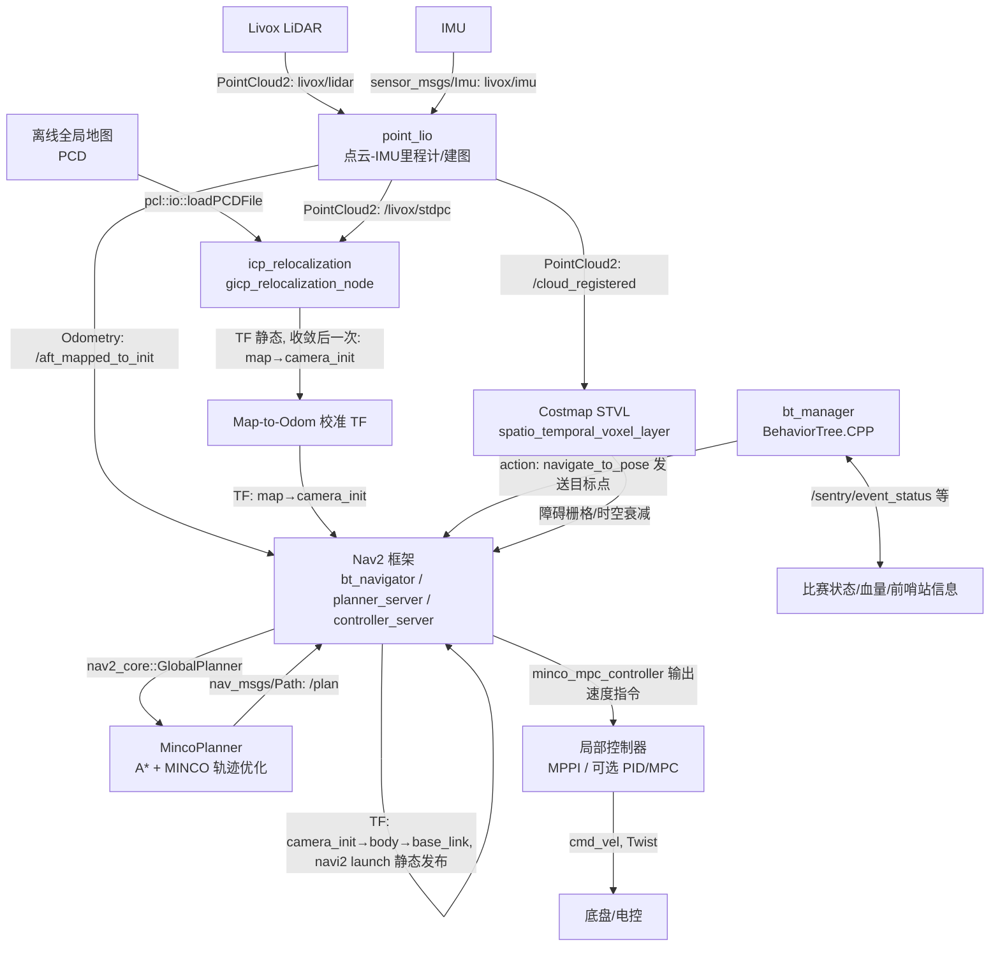

# RoboMaster 2026 哨兵导航与决策系统（北京理工大学，ROS 2 Humble）

这是 **2026 赛季北京理工大学（BIT）哨兵导航系统代码仓库**，面向 RoboMaster 哨兵平台的 ROS 2 集成工程。系统覆盖 **感知（双雷达融合/Livox + Point-LIO）**、**重定位（Small_GICP）**、**导航（Nav2 + 自定义 MINCO 时空联合规划 + ESDF）**、**局部控制（MPC）** 与 **决策（BehaviorTree.CPP）**。

> 一键启动入口：`bash start.bash`（Livox → Point-LIO → icp_relocalization → Nav2，可选 bt_manager/communication）

---

## 1. 仓库简介

本项目致力于打造一套高鲁棒性、高敏捷度的 RM 哨兵自主导航架构。针对比赛中复杂动态障碍与高频机动需求，采用基于 MINCO 的平滑轨迹优化与 MPC 局部跟踪，并结合离线 ESDF 先验地图与高频 LIO 里程计，实现哨兵在赛场中的高速巡逻、智能避障与交火决策。

---

## 2. 文件结构 (`src/`)

```text
src/
├── decision
│   └── bt_manager            # 决策模块 (BehaviorTree.CPP)
├── navigation
│   ├── back_up_twz_free      # 已弃用的恢复行为
│   ├── communication         # 上下位机通信
│   ├── minco_controller      # MPC 局部控制器
│   ├── minco_planner         # MINCO 时空联合全局规划器
│   └── navi2_bringup         # 参数文件与启动脚本配置包
├── perception
│   ├── dbscan_cluster        # 点云聚类跟踪（未启用）
│   ├── icp_relocalization    # Small_GICP 重定位
│   ├── lidar_merger          # 双雷达融合节点
│   ├── livox_ros_driver2     # 雷达驱动节点
│   ├── msg_convert           # 点云格式转换、裁剪节点
│   ├── Point-LIO             # 高频激光惯性里程计
│   └── rog_map               # 滑动窗口地图（未启用）
├── ros_interfaces            # 自定义 ROS 2 消息
│   ├── CMakeLists.txt
│   ├── msg
│   └── package.xml
└── utils
    ├── bt_editor             # 可视化行为树编辑器
    ├── data_analyzer         # 数据分析 demo
    ├── pcd2ele               # 高程图生成器
    ├── pcd2esdf              # ESDF 先验地图生成器
    ├── pcd2pgm               # PGM 栅格地图生成器
    ├── pcd_trans             # 点云转换器
    └── rotmat_cal            # 旋转矩阵计算器
```

---

## 3. 系统启动与整体架构（速览）

推荐直接使用一键脚本启动：bash start.bash。

系统链路可以概括为：

1. Livox 与 IMU 输入进入 Point-LIO，输出高频里程计与标准点云。
2. icp_relocalization 对齐离线地图，发布 map 到 camera_init 的全局校准 TF。
3. Nav2 调用 MincoPlanner 与 MincoMpcController 完成路径规划和跟踪。
4. bt_manager 提供比赛策略，communication 下发底盘控制。

下图保留完整系统关系图：



---

## 4. 核心模块原理深度解析

### A. 导航算法：MincoPlanner

它是 Nav2 GlobalPlanner 的自定义插件。前端在 costmap 网格上做 A* 搜索保证可行性（避障/连通），后端对前端路径做路标稀疏化后，使用 MINCO 优化一条分段多项式轨迹（满足速度/加速度约束，带有时间与吸引点惩罚）。本赛季结合 ESDF（Euclidean Signed Distance Field）进一步增强了对静态/动态障碍物边界的平滑感知。

### B. 局部控制器：MincoMpcController (Local Controller)

专为跟踪 Minco 轨迹设计的非线性模型预测控制器。基于高频里程计做延迟补偿外推，计算满足动态约束的速度矢量。
注意：该控制器直接输出世界坐标系下的速度指令，下位机底盘必须处于“绝对坐标系控制模式”或根据底盘 Yaw 角自行分解，以保证云台剧烈旋转时底盘依然平滑运动。

### C. 感知与重定位：ICP Relocalization

利用 small_gicp 读取离线 PCD 全局地图做配准。使用 Point-LIO 提供的高频里程计坐标系（camera_init）作为初始参照，SAC-IA 粗配准 + GICP 精对齐，收敛后发布一次静态 TF（map -> camera_init）修正里程计漂移。

### D. 决策系统：bt_manager

基于 BehaviorTree.CPP v3 构建。通过黑板状态（血量、敌方前哨站、目标锁定等）控制状态机流转。优先处理紧急撤退（受击/残血 回 HOME 点），其次为前哨站响应（防御），最后为常规巡逻与目标追击。

---

## 5. 如何使用 (Usage & Build)

### 5.1 环境依赖与安装

本系统依赖于 ROS 2 Humble，并且需要安装以下核心第三方库：

```bash
# 1. 安装基础工具与 ROS 2 依赖
sudo apt update
sudo apt install libeigen3-dev libpcl-dev libceres-dev
sudo apt install ros-humble-nav* ros-humble-spatio-temporal-voxel-layer* ros-humble-openvdb-vendor*

# 2. 安装 Livox-SDK2
git clone https://github.com/Livox-SDK/Livox-SDK2.git
cd Livox-SDK2 && mkdir build && cd build
cmake .. && make -j
sudo make install

# 3. gcopter 等其它数学库请参考官方文档通过源码编译安装
```

### 5.2 编译构建

由于部分导航和建图包对内存消耗极大，强烈推荐使用仓库内提供的全量编译脚本。该脚本会优先编译大内存功能包，避免内存爆炸导致编译卡死，同时附带了符号链接（方便改参）与详细的终端输出：

```bash
# 在工作空间根目录下运行
./build.bash
```

### 5.3 建图与先验地图导航流程

步骤一：构建点云地图 (SLAM)
如果你需要扫描新场地的地图，开启雷达与里程计后运行以下命令启动建图：

```bash
ros2 launch navi2_bringup slam.launch.py
```

建图完成后保存 PCD 格式文件。

步骤二：生成全局 ESDF 图
由于本系统导航依赖先验地图，需要提前生成 ESDF 地图：

1. 打开 utils/pcd2esdf/config/，配置好刚扫描出的 PCD 输入文件路径和 ESDF 期望的输出文件路径。
2. 运行 ESDF 生成节点（请自行调用相关 launch 或可执行文件）。
3. 得到生成的 ESDF PCD 文件。

步骤三：配置导航参数
将生成的 ESDF 点云文件路径填入导航参数文件中：

1. 打开 src/navigation/navi2_bringup/params/ 下的参数文件（如 sentry.yaml）。
2. 在 planner_server/MincoPlanner 下找到 esdf 相关的配置项，填入 ESDF 地图路径。

### 5.4 比赛一键运行

系统所有硬件挂载、TF 发布、重定位和导航规划统一封装在 start.bash 中：

```bash
bash start.bash
```

---

## 6. 参考文献与开源项目

- [BehaviorTree.CPP](https://github.com/BehaviorTree/BehaviorTree.CPP)
- [GCOPTER](https://github.com/ZJU-FAST-Lab/GCOPTER)
- [Livox-SDK2](https://github.com/Livox-SDK/Livox-SDK2)
- [Point-LIO](https://github.com/hku-mars/Point-LIO)
- [small_gicp](https://github.com/koide3/small_gicp)

---

## 7. 联系方式

- 联系人：喻衡
- QQ：2914335251
