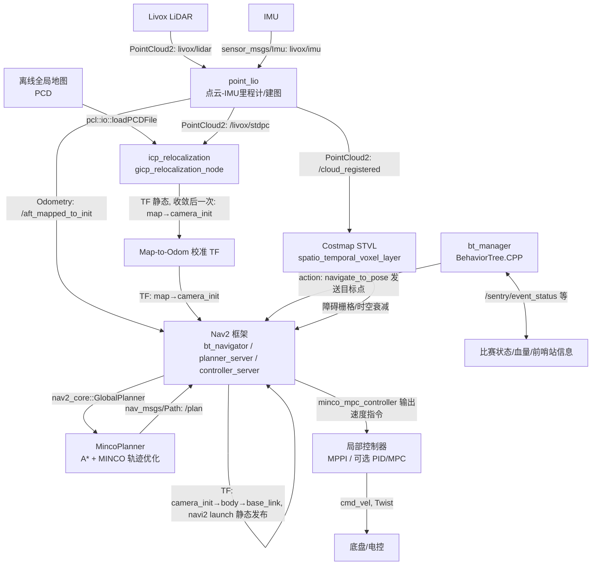
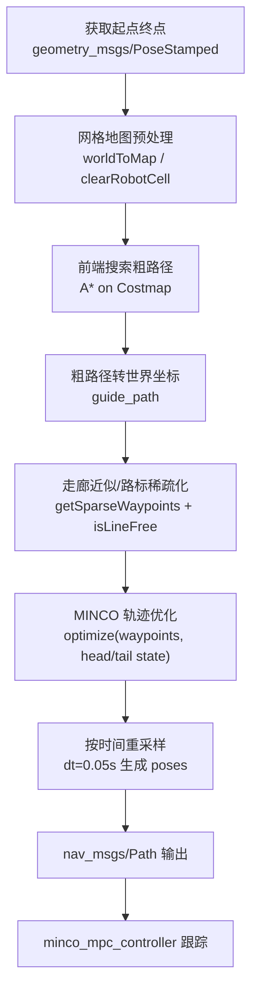
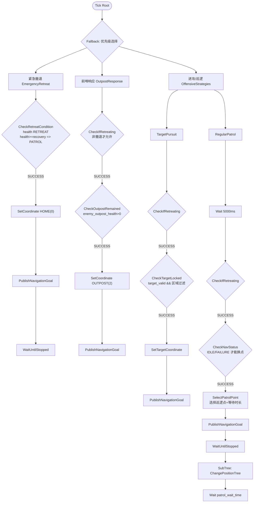

# RoboMaster 2025 哨兵导航与决策系统（ROS 2 Humble）

这是一个面向 RoboMaster 哨兵平台的 ROS 2 集成工程，覆盖 **感知（Livox + Point-LIO）**、**重定位（ICP/GICP）**、**导航（Nav2 + 自定义 MINCO 全局规划）**、**局部控制（MPPI / 可选 PID 等）** 与 **决策（BehaviorTree.CPP）**。

> 一键启动入口：`start.bash`（Livox → Point-LIO → icp_relocalization → Nav2，可选 bt_manager/communication）

---

## 1. 系统启动全流程 (System Workflow)

本系统的启动逻辑封装在 `start.bash` 脚本中，实现了从硬件驱动到上层决策的自动化挂载。

### Step 1: 硬件驱动 (Hardware Driver)
*   **Node**: `livox_ros_driver2`
*   **功能**: 驱动 MID-360 激光雷达。
*   **输出**: 发布 `/livox/lidar` (包含自定义 Tag 信息) 和 `/livox/imu` 原始数据。

### Step 2: 里程计 (Odometry)
*   **Node**: `point_lio`
*   **功能**: 运行高频激光惯性里程计 (LIO) 并去除点云运动畸变。
*   **关键输出**:
    *   `/aft_mapped_to_init`: 高频里程计（用于控制反馈）。
    *   `/livox/stdpc(msg_convert输出)` / `/cloud_registered`: 畸变去除后的标准点云（用于建图与重定位）。

### Step 3: 初始重定位 (Relocalization)
*   **Node**: `icp_relocalization` (GicpRosInterface)
*   **功能**: 修正里程计累计漂移，提供全局一致性。
*   **状态机流程**:
    1.  **UNINITIALIZED**: 等待点云帧累积（Accumulate Frames）。
    2.  **INITIALIZING**: 使用 **SAC-IA或Initial pose** 进行粗配准，快速对齐全局地图。
    3.  **CONVERGING**: 使用 **GICP (Generalized ICP)** 进行精细迭代优化。
    4.  **LOCALIZED**: 连续 N 帧收敛后锁定状态。
*   **关键动作**: 收敛后发布静态 TF `map` -> `camera_init`，将 Point-LIO 的局部坐标系对齐到全局地图。

### Step 4: 导航栈 (Navigation Stack)
*   **Launch**: `navi2/launch/navigation2.launch.py`
*   **核心服务**:
    *   **Planner Server**: 加载自定义插件 `MincoPlanner`。
    *   **Controller Server**: 加载自定义插件 `MincoMpcController`。
*   **Costmap**: 启动 `spatio_temporal_voxel_layer` 构建动态体素地图。

### Step 5: 决策与通信 (Decision & Comm)
*   **Node**: `bt_manager` (Behavior Tree)
    *   处理比赛逻辑（巡逻、追击、逃跑），发送 Action 指令给 Nav2。
*   **Node**: `communication`
    *   将上层规划的速度指令下发给 STM32 底盘，同时回传裁判系统数据。

---

## 2. 系统整体架构（System Architecture）

下图是“从传感器到控制”的完整链路（以本仓库现有默认配置为准），标注了核心 Topic / TF 关系。



说明（与代码/参数对应）：

- `point_lio` 默认订阅 `livox/lidar` 与 `livox/imu`（见 `Point-LIO/config/mid360.yaml`）。
- Nav2 的 `bt_navigator.odom_topic` 配置为 `/aft_mapped_to_init`（见 `navi2_bringup/params/sentry2.yaml`）。
- STVL（SpatioTemporalVoxelLayer）以 `/cloud_registered` 作为观测源构建动态障碍层（见 `navi2_bringup/params/sentry2.yaml` 的 `stvl_layer.observation_sources`）。
- `icp_relocalization` 收敛后发布 `map_frame -> cloud_frame_id` 的静态 TF（常见为 `map -> camera_init`，见 `icp_relocalization/src/gicp_ros_interface.cpp`）。

> 重要：当前 `navi2_bringup/launch/navigation2.launch.py` 也会静态发布 `map -> camera_init`。如果同时启动 `icp_relocalization`，请确保 TF 来源唯一，否则会出现 TF 冲突/抖动。

---

## 3. 核心模块原理深度解析（Core Modules）

### A. 导航算法：MincoPlanner

#### A.1 它是什么

`minco_planner/MincoPlanner` 是一个 Nav2 GlobalPlanner 插件（pluginlib 导出），在 `planner_server` 中与 `SmacPlanner2D` 并列注册：

- 插件声明：`navigation/minco_planner/global_planner_plugin.xml`
- Nav2 参数启用：`navi2_bringup/params/sentry2.yaml` → `planner_server.planner_plugins: ["SmacPlanner", "MincoPlanner"]`

它的核心目标不是“只输出离散 A* 栅格路径”，而是输出 **可控、更平滑** 的轨迹型 Path：

1) **前端**：在 costmap 网格上做 A* 搜索，保证可行性（避障/连通）
2) **后端**：对前端路径做路标稀疏化后，使用 MINCO 优化一条分段多项式轨迹（满足速度/加速度约束，并带有时间与吸引点惩罚）

#### A.2 前端：A* 粗路径（可行性骨架）

入口在 `MincoPlanner::createPlan()`，内部调用 `makePlan()`：

- 将 `start/goal` 的世界坐标投影到网格：`costmap_->worldToMap()`
- 设置 A* 搜索：`astar_planner_->setStart/setGoal/setupNavFn/setCostmap()`
- 循环传播波前（上限为 `nx*ny` 防死循环），再 `calcPath()` 提取路径
- 将路径点从地图坐标转换回世界坐标，得到 `guide_path`（`std::vector<Eigen::Vector3d>`）

这里的 A* 负责“可达与避障”，而不是追求轨迹的可控性/平滑性。

#### A.3 路标稀疏化与“走廊”思想

代码中没有显式构建几何意义上的 Flight Corridor（多边形/椭圆走廊约束）。但它实现了一个**简化的走廊思想**：

- `getSparseWaypoints()` 使用固定前视距离（约 `2m`，由 `2.0 / costmap_resolution` 推导）在路径上做“跳点”
- 通过 `isLineFree(p1, p2)` 做直线段可行性检测（沿线采样查 costmap），能连通则用直线段替代原始折线路径

效果：

- 将 A* 的高频折线“压缩”为少量关键路标（降低优化维度）
- 用“线段可行”近似了一个可行走廊（至少保证线段不穿越障碍栅格）

如果你希望严格 Flight Corridor（可生成更强的安全约束），建议在 `sparse_path` 基础上引入 corridor 生成（如膨胀障碍、生成凸多边形走廊），并把走廊约束加入后端优化的约束项。

#### A.4 后端：MINCO 轨迹优化（Minimum Control）

`MincoOptimizer::optimize()` 负责将稀疏路标转为分段多项式轨迹。

**优化变量**

- 时间：每段时长 $T_i$（内部用 `tau` 做正映射/反映射，保证 $T_i>0$）
- 内点：每段的中间控制点/路标（` 0      .                     `）

**目标函数costFunctional()**

总代价近似为：

$$J = J_{energy}(\text{MINCO}) + J_{constraints} + \rho \sum_i T_i$$

- $J_{energy}$：由 minco solver 的能量项给出（通过 `getEnergy()` + 梯度接口）
- $J_{constraints}$：通过 `constraintsFunctional()` 进行积分采样评估
	- 速度约束：$\|v\|^2 - v_{max}^2$ 的平滑 $L1$ 惩罚（`smoothedL1`）
	- 加速度约束：$\|a\|^2 - a_{max}^2$ 的平滑 $L1$ 惩罚
	- 吸引点（Attract）惩罚：轨迹在采样点处对 waypoint 的吸引（权重 `penalty_weight_att`）
- $\rho\sum T_i$：时间惩罚（参数 `penalty_weight_time` 在代码中对应 `cfg_.rho`）

**数值优化**

- 使用 L-BFGS（`lbfgs_optimize`）
- 终止精度来自 `opt_accuracy`
- 采样积分分辨率来自 `integral_res`（每段分成 `integral_res` 份积分近似）

#### A.5 “时空约束（Spatio-Temporal Constraints）”如何落地

严格意义的时空约束（障碍物随时间演化）通常由两部分共同承担：

1) **时空感知层**：用 STVL 将点云观测写入“随时间衰减”的体素/栅格层（本仓库在 `local_costmap` / `global_costmap` 中均启用了 `spatio_temporal_voxel_layer/SpatioTemporalVoxelLayer`）
2) **控制层**：局部控制器在短时域内做碰撞代价评估并输出控制

而当前 MincoPlanner 作为全局规划器：

- 主要读取“规划时刻”的 costmap 栅格（`astar_planner_->setCostmap(costmap_->getCharMap(), ...)`）
- 后端优化只显式约束了速度/加速度与 waypoint 吸引，并未引入动态障碍的显式时间维约束

因此在本工程里，“时空约束”的主要承载是 **STVL + MPPI**，MincoPlanner 负责提供一条更平滑、可控、对 Nav2 更友好的全局参考轨迹。

#### A.6 MincoPlanner 内部运作流程图（Mermaid）



#### A.7 关键可调参数（与代码一致）

来自 `navi2_bringup/params/sentry2.yaml` → `planner_server.MincoPlanner`：

```yaml
MincoPlanner:
	plugin: "minco_planner/MincoPlanner"
	tolerance: 0.5
	use_astar: true
	allow_unknown: false
	minco_optimizer:
		max_velocity: 2.0
		max_acceleration: 5.0
		time_allocation_iters: 15
		penalty_weight_time: 10.0
		smooth_eps: 0.01
		integral_res: 16
		opt_accuracy: 0.0001
		penalty_weight_vel: 1000.0
		penalty_weight_acc: 10000.0
		penalty_weight_att: 10000.0
```

调参建议（经验向、但不脱离代码）：

- 速度/加速度“超限惩罚权重”越大，越倾向严格满足 $v_{max}, a_{max}$，但可能更容易让优化困难或时间变长。
- `integral_res` 越大约束评估越精细，但计算更重。
- `penalty_weight_time` 越大越偏向“快”，通常会推高速度/加速度的边界触发惩罚，需要配合其它权重。

---

### B. 局部控制器：MincoMpcController (Local Controller)

这是一个专为跟踪 Minco 轨迹设计的非线性模型预测控制器（替代了默认的 MPPI）。

**输入**:
*   订阅 `/opt_path` 获取参考轨迹（包含完整多项式系数）。
*   订阅 `/aft_mapped_to_init` 获取高频里程计。

**延迟补偿 (Latency Compensation)**:
由于通信与计算存在延迟，控制器会基于里程计历史和当前速度，将机器人状态外推至“未来时刻”（`dt_delay`），确保控制指令匹配机器人当前的真实状态。

**MPC 求解**:
构建优化问题，在满足动态约束的前提下，计算能最好跟踪参考轨迹的速度矢量。

#### ⚠️ [关键细节] 世界系速度控制 (World Frame Velocity Control)

与其他常见的机器人控制器（通常输出 Body Frame 速度，如 `cmd_vel.linear.x` 为前进）不同，**MincoMpcController 直接输出世界坐标系下的速度指令**。

*   **代码依据**: `linear_x = u_global.x();` (在 `computeVelocityCommands` 中直接赋值求解结果)
*   **硬件要求**: 下位机（底盘 MCU）**必须** 处于“绝对坐标系控制模式”或自行根据底盘当前的 Yaw 角进行向量分解。
*   **设计意图**: 哨兵云台通常带有增稳功能（云台与底盘解耦）。在世界系规划与控制有助于在云台剧烈旋转时，底盘仍能平滑地沿预定轨迹移动，不受云台姿态干扰。

---

### C. 感知与重定位：ICP Relocalization（icp_relocalization）

本模块解决的问题是：

> Point-LIO 在短时间内给出高频里程计（`camera_init` 相关坐标系），但会有手动摆放误差；`icp_relocalization` 用离线全局地图（PCD）做配准，在 **收敛后发布一次静态 TF** 将 `camera_init/odom` 锚定到 `map`，从而修正漂移。

#### B.1 输入、输出与状态机

节点：`gicp_relocalization_node`（见 `icp_relocalization/src/gicp_node.cpp`）

- 输入：
	- 点云：订阅 `/livox/stdpc`（`SensorDataQoS`）
	- 地图：读取 `target_pcd_file` 指定的 PCD（`pcl::io::loadPCDFile`）
- 输出：
	- `/gicp_map`：加载的目标地图点云（`transient_local`）
	- `/gicp_source`：累积后的源点云（debug）
	- `/gicp_aligned`：对齐到 map 下的点云（debug）
	- TF：收敛后发布一次 `map_frame -> cloud_frame_id`（通常 `map -> camera_init`）

状态机（见 `icp_relocalization/src/gicp_ros_interface.cpp`）：

- `UNINITIALIZED`：等待累积足够点云帧；根据 `mode` 决定走 SAC-IA 或初值模式
- `INITIALIZING`：运行 `initialAlign()`（SAC-IA 粗对齐）得到初始 `map_to_camera_init_`
- `CONVERGING`：用上一帧结果作为初值不断跑 GICP，直到连续满足 `fitness_score_threshold` 达到 `converged_count_threshold`
- `LOCALIZED`：停止继续对齐（节省 CPU），仅保持静态 TF

#### B.2 如何利用 Point-LIO 里程计作为“初值”

代码层面它不直接订阅 Point-LIO 的 odom 作为数值初值，而是采用更工程化的方式：

1) **源点云所在坐标系**（`cloud_frame_id_`）来自点云消息 header（常见为 `camera_init`），该坐标系由 Point-LIO 持续更新（即“高频里程计在驱动点云姿态/坐标系”）
2) GICP 的迭代初值取自上一次的 `map_to_camera_init_`（`Eigen::Matrix4f initial_guess = map_to_camera_init_`）

因此“里程计初值”体现在：源点云已经被表达在一个随时间变化的里程计坐标系中；重定位只需要求出 `map -> 里程计系` 的对齐。

#### B.3 配准链路（从点云到 TF）

核心算法封装在 `GicpFilter`（`icp_relocalization/src/gicp_filter.cpp`）：

1) 地图预处理（`preprocessMap`）
	 - remove NaN
	 - 可选高度裁剪（PassThrough z）
	 - VoxelGrid 降采样（`target_voxel_leaf_size`）
	 - 计算法线与 FPFH（`feature_k_search`）
2) 初始对齐（`initialAlign`）
	 - 源点云可选高度裁剪
	 - VoxelGrid 降采样（`source_voxel_leaf_size`）
	 - 源点云计算 FPFH
	 - SAC-IA（`SampleConsensusInitialAlignment`）做粗对齐
	 - 将 SAC-IA 的结果作为初值进入 GICP 精对齐
3) 精对齐（`align`）
	 - 源点云可选高度裁剪 + 降采样
	 - `pcl::GeneralizedIterativeClosestPoint` 计算 `final_transformation`

当 CONVERGING 达到门限后，调用 `publishStaticTf()` 发布静态 TF：

- `t.header.frame_id = map_frame_`
- `t.child_frame_id = cloud_frame_id_`（通常 `camera_init`）

这就是“发布 map->odom 修正漂移”的关键落点。

#### B.4 性能优化：高度滤波（PassThrough on z）

为了减少参与 FPFH + SAC-IA + GICP 的点数，本仓库已在 `GicpFilter` 中加入了可配置的高度裁剪：

```yaml
height_filter:
	enable: true
	min_z: 0.0
	max_z: 5.0
```

它会在：地图预处理、初始对齐、精对齐三个阶段都优先执行（先裁剪再体素/特征），对 CPU 占用和收敛速度通常更友好。

---

### D. 决策系统：bt_manager（Decision）

`bt_manager` 使用 BehaviorTree.CPP v3，通过 `navigate_to_pose` action 给 Nav2 下发目标点。

#### C.1 黑板与状态（对应“巡逻/受击/响应”）

黑板初始化（见 `decision/bt_manager/include/bt_manager/blackboard.hpp`）包含：

- `health`：血量（受击/低血量触发撤退）
- `enemy_outpost_health`：敌方前哨站血量（触发 RESPONSE）
- `target_valid/target_pose/target_armor_id`：目标锁定信息（触发 ATTACK 追击）
- `nav_status`：导航状态（是否允许选择下一巡逻点）

> “充能/补给”在代码中以 `nav_points[1] = BONUS` 形式预留（`nav_zone.cpp`），但在当前 `nav_tree.xml` 主逻辑里尚未接入对应的 Sequence。要实现“充能模式”，可新增一条分支在 Fallback 中通过 `SetCoordinate goal="1"` 下发 BONUS 点。

#### C.2 决策逻辑图

主树：`decision/bt_manager/tree/nav_tree.xml`。



这个图对应你关心的“状态切换”：

- 受击/低血量：`CheckRetreatCondition` 进入撤退，直到血量恢复到 `recovery_threshold` 才退出。
- 巡逻：在 `nav_status` 允许时通过 `SelectPatrolPoint` 循环下发巡逻点。
- 进攻：`target_valid` 且区域过滤通过后进入 `ATTACK`，使用目标位姿作为导航目标。

---

## 4. 使用指南与依赖（Usage & Build）

### 3.1 关键依赖（按代码/配置实际使用）

- ROS 2 Humble
- `livox_ros_driver2`
- PCL：`pcl_ros`、`pcl_conversions`（ICP/GICP + 点云处理）
- Nav2：`nav2_bringup`、`nav2_smac_planner`、`nav2_mppi_controller`、`nav2_bt_navigator` 等
- Spatio-Temporal Voxel Layer：`spatio_temporal_voxel_layer` + `openvdb_vendor`
- BehaviorTree：`behaviortree_cpp_v3`
- TF：`tf2`/`tf2_ros`/`tf2_eigen`

apt 安装提示：

```bash
sudo apt install ros-humble-nav*
sudo apt install ros-humble-spatio-temporal-voxel-layer*
sudo apt install ros-humble-openvdb-vendor*
```

（可选）使用 rosdep 自动补依赖：

```bash
rosdep install -r --from-paths src --ignore-src --rosdistro $ROS_DISTRO -y
```

### 3.2 编译

全量编译（见 `build.bash`）：

```bash
colcon build --symlink-install --cmake-args -DCMAKE_BUILD_TYPE=Release -DCMAKE_EXPORT_COMPILE_COMMANDS=1
```

核心包编译（见 `build_client.bash`）：

```bash
colcon build --symlink-install --packages-select icp_relocalization point_lio communication navi2 ros_interfaces pcd2pgm small_gicpapp bt_manager --cmake-args -DCMAKE_BUILD_TYPE=Release -DCMAKE_EXPORT_COMPILE_COMMANDS=1
```

### 3.3 启动

推荐直接使用 `start.bash`（该脚本依赖 `gnome-terminal`，会开多个终端）：

1) source 本工作区：`source ~/2025-sentry-navi/install/setup.bash`
2) source Livox 工作区：`source ~/ws_livox/install/setup.bash`
3) `ros2 launch livox_ros_driver2 msg_MID360_launch.py`
4) `ros2 launch point_lio point_lio.launch.py`
5) `ros2 launch icp_relocalization gicp_relocalization.launch.py`
6) `ros2 launch navi2 navigation2.launch.py`
7) 可选：`ros2 launch bt_manager bt_manager.launch.py`
8) 可选：`ros2 launch communication com.launch.py`

如果你运行在无桌面环境，请按上述顺序在多个终端中手动执行。


