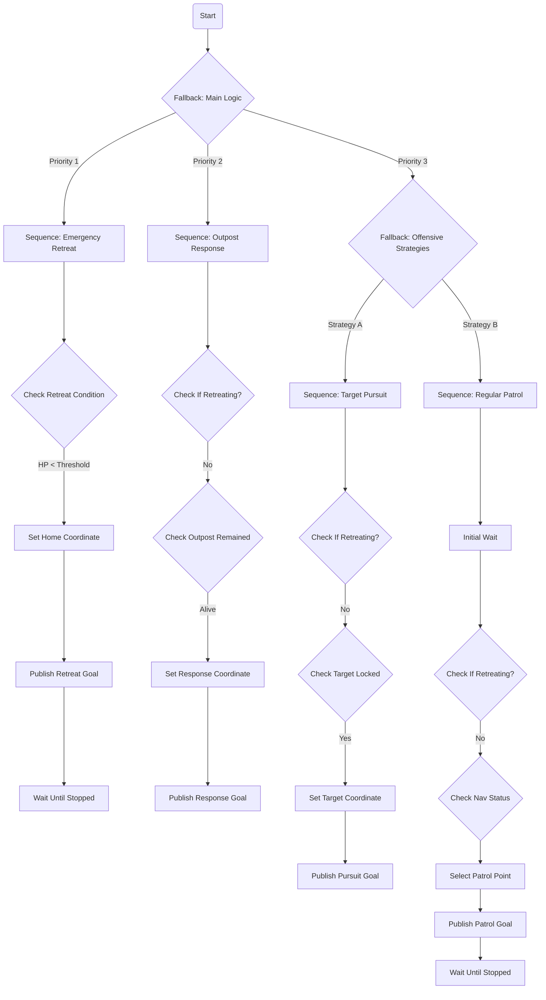

# Dream Chaser Sentry Navi ROS2 导航系统

## 项目结构与功能说明

### 1. 决策层（decision）
负责哨兵战场形势判断、自身情况监测。核心逻辑基于 **BehaviorTree.CPP** 构建，实现了分层级的行为调度。

**决策逻辑流程图 (Mermaid)**：



### 2. 导航层（navigation）
基于 **ROS 2 Nav2** 框架，针对哨兵机器人的高机动性进行了深度定制。

**Nav2 架构与自定义插件**：
- **控制器 (Controller)**：集成了 PID、MPC 等算法，适配全向移动底盘。
- **规划器 (Planner)**：支持 A*、Hybrid A* 等全局路径规划。
- **地图服务器 (Map Server)**：除了标准的 Costmap 2D，还集成了 **ROG-Map**。

**核心组件：ROG-Map (Rolling Occupancy Grid Map)**
ROG-Map 是一个高性能的动态局部地图构建方案，主要特性包括：
- **滑动窗口机制 (Map Sliding)**：支持地图随机器人移动而动态滑动，始终保持机器人在地图中心区域，适合长距离导航。
- **多维感知**：
    - **概率栅格图 (Probabilistic Map)**：基于贝叶斯更新的占据栅格地图。
    - **高程图 (Elevation Map)**：维护 2.5D 地形信息，用于坡度分析。
    - **ESDF (Euclidean Signed Distance Field)**：实时计算欧氏距离场，辅助避障规划。
- **数据源支持**：支持实时点云输入 (Livox/Standard) 及静态 PCD 文件加载。

### 3. 感知层（perception）
- **重定位（icp_relocalization）**：上电初始位姿纠正，采用 ICP/SAC-IA/NDT 融合算法，支持点云地图快速配准。
- **里程计定位（Point-LIO）**：高频率、高鲁棒性的激光-惯导里程计，适应剧烈运动和 IMU 饱和场景，后续定位主要依赖此模块。
- **点云处理与地图生成（pcd2pgm）**：将 .pcd 点云文件转换为导航用 .pgm 栅格地图，支持滤波与参数自定义。
- **small_gicpapp**：集成 [small_gicp](https://github.com/koide3/small_gicp) 高效点云配准库，提升重定位与建图性能。

### 4. 通信与协议（communication & interfaces）
定义了上下位机及多机通信的协议标准，主要文件位于 `custom_protocol.hpp`。

**主要消息类型 (PacketTypeEnum)**：
- `HEART_BEAT (0)`: 心跳包，维持连接状态。
- `ARMOR_DATA (2)` / `DETECTOR_DATA (12)`: 敌方装甲板与探测数据。
- `SENTRY_SEND_CONTROL_DATA (3)`: 哨兵发送给底盘的控制指令。
- `NAV_DATA (14)`: 导航状态反馈。
- `GAMESTATUS_DATA (13)`: 比赛裁判系统数据（血量、比赛阶段等）。

**关键数据结构**：
- **NavRes (STM32 -> PC)**: 反馈当前坐标 `(x, y, yaw)` 及是否到达目标 `is_reach`。
- **ChassisTarget (PC -> STM32)**: 下发速度指令 `(vx, vy, vw)` 及云台期望角度。
- **EventStatus**: 包含自身血量、比赛事件（前哨站状态、Buff状态）、敌方位置信息等。

---

## 使用说明

### 依赖安装

```bash
# ROS2 Humble 及相关组件
sudo apt install ros-humble-nav2*  
sudo apt install ros-humble-spatio-temporal-voxel-layer*
sudo apt install ros-humble-openvdb-vendor*
sudo apt install ros-humble-pcl-conversions ros-humble-pcl-msgs
sudo apt install libpcl-dev libeigen3-dev
# Livox 驱动与 SDK
# 参考 https://github.com/Livox-SDK/livox_ros_driver2
# 参考 https://github.com/Livox-SDK/Livox-SDK2
# OpenMP 支持
sudo apt install libomp-dev
```

### 额外依赖

- 编译并安装 [small_gicp](https://github.com/koide3/small_gicp)（用于高效点云配准）
- 推荐安装 `pcl_ros`、`pcl_conversions`、`pcl-tools` 等点云处理库
- 参考各子模块 README 安装 Livox 驱动、配置 IMU/LiDAR 参数

### 编译与运行

```bash
cd /path/to/2025-sentry-navi
rosdep install -r --from-paths src --ignore-src --rosdistro $ROS_DISTRO -y
colcon build --symlink-install
source install/setup.bash
```

---


---

## 指令集与调试说明

### 常用指令集

- 启动主程序、仿真、各功能节点请参考各模块 launch 文件和 play.bash、start.bash 脚本
- 清理与重编译：
	```bash
	./clean.bash && ./build.bash
	```
- 单独编译客户端（无Point_LIO）：
	```bash
	./build_client.bash
	```

### CMake 调试输出

在构建时通过 `-DCMAKE_BUILD_TYPE` 和调试标志可获得详细的调试信息：

```bash
# 通信模块调试
colcon build --symlink-install -DCOM_DEBUG=ON

# ICP 重定位调试
colcon build --symlink-install -DICP_DEBUG=ON

# 决策层调试
colcon build --symlink-install -DDECISION_DEBUG=ON

# 组合调试（同时启用多个模块调试）
colcon build --symlink-install -DCOM_DEBUG=ON -DICP_DEBUG=ON -DDECISION_DEBUG=ON
```

也可在 CMakeLists.txt 中直接配置这些标志，或通过 `--cmake-args` 参数传入：

```bash
colcon build --symlink-install --cmake-args -DCOM_DEBUG=ON -DICP_DEBUG=ON -DDECISION_DEBUG=ON
```

---

## 其他说明

- 各模块详细参数与用法请参考 `src/` 下各自 README.md
- 建议优先完成控制器插件重写，提升运动控制性能
- 感知与导航层高度解耦，便于后续扩展与维护

---

