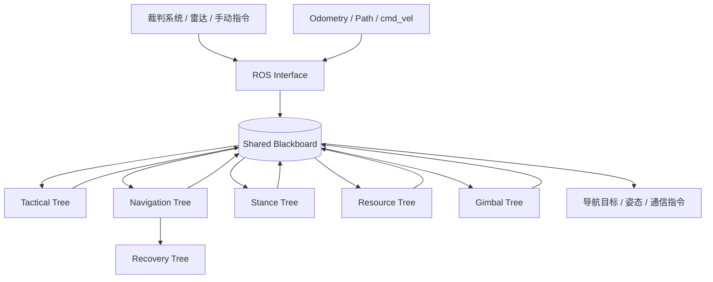

# 🌳 BT Manager

> RoboMaster 哨兵机器人自主决策中枢：基于 BehaviorTree.CPP，将裁判系统状态、导航目标、姿态控制、资源决策与恢复行为组织为可审计的响应式策略树。

[返回项目主页](../../../README.md) · [MINCO Planner](../../navigation/minco_planner/README.md)

## ✨ 模块定位

`bt_manager` 不直接实现轨迹规划或底盘闭环控制，而是决定机器人“当前应该做什么”：选择战术模式、生成导航目标、切换姿态、请求资源、处理人工接管，并将结果写入共享 blackboard 或发布到 ROS 2 接口。

模块使用 BehaviorTree.CPP v3。主程序以多线程执行器处理 ROS 回调，行为树以 **10 Hz** tick；多个子树共享同一 blackboard。

## 🧠 模块流程图



### 流程概述

ROS Interface 持续把裁判系统、定位、轨迹、速度和人工输入写入共享 blackboard。主循环以 10 Hz tick 多棵行为树；每棵树按 XML 中当前未注释节点和响应式控制节点的顺序评估，写回战术模式、导航目标、姿态、资源或云台指令。导航目标交给 Nav2，姿态/资源等指令经 communication 发送到底盘和裁判链路。

## 🧪 技术方向

- 行为树 XML 是策略主入口，C++ 插件实现 condition/action/decorator，blackboard 是跨子树状态契约。
- `ReactiveFallback` 的节点顺序即优先级；`ReactiveSequence` 中任一 condition 失败会阻断后续 action。
- 裁判协议、blackboard 枚举、XML 端口和 communication 打包共同组成跨模块接口，不能只修改其中一处。
- 行为树负责“选择行为”，不长期替代 Planner/Controller 的连续闭环。

## ⚡ 性能方向

- 10 Hz tick 与 ROS 多线程执行器分离；日志以状态变化为主，避免逐 tick 高频输出。
- `bt_debug_logs`、`bt_debug_log_to_file` 和日志路径参数控制转移日志，文件日志默认关闭。
- `/sentry/area_markers` 使用 `KeepLast(1) + reliable + transient_local`，RViz 后加入时仍能取得最近一组区域 Marker。
- 本模块当前没有逐 tick CSV `PerformanceMonitor`；BT 的可观测性来自状态转移日志、ROS topic 和 Marker，不应与导航链路的性能 CSV 混为一谈。

当前实际行为必须以 `tree/*.xml` 中**未注释的节点与顺序**为准。`ReactiveFallback` 从上到下表示优先级；高优先级条件重新满足时，会抢占低优先级分支。

## 🗺️ 生效树文件

| 文件 | 职责 | 当前重点 |
|---|---|---|
| `tactical_tree.xml` | 战术模式选择 | 人工/进攻条件优先，其余进入常规模式 |
| `nav_tree.xml` | 主导航决策 | 人工覆盖、前哨站进攻、补给与全局资源等响应式分支 |
| `stance_tree.xml` | 车体姿态 | 隧道对齐、人工增强姿态、进攻与移动姿态 |
| `resource_tree.xml` | 资源请求 | 复活、血量与弹量兑换等生效分支 |
| `recovery_tree.xml` | 导航恢复 | 当前包含隧道后退脱困动作 |
| `gimbal_tree.xml` | 云台相关行为 | 根据共享状态执行云台策略 |

> XML 中保留的注释分支属于历史或待验证方案，不代表运行能力，也不应仅因“看起来完整”而启用。

## 🔑 Blackboard 契约

Blackboard 是决策树与 ROS 接口间的状态契约。修改 key 名称、类型或写入优先级可能同时影响多个子树。

| Key | 语义 | 典型生产者 / 消费者 |
|---|---|---|
| `tactical_mode` | 战术层模式 | tactical tree → navigation/stance/resource |
| `current_mode` | 当前导航/行为模式 | mode 节点与 ROS 通信 |
| `nav_goal` | 当前导航目标 | nav tree → Nav2 action 节点 |
| `desired_stance` | 目标姿态 | stance tree → 通信接口 |
| `current_stance` | 实际姿态反馈 | 裁判/下位机回调 → stance conditions |
| `desired_lifter_pos` | 目标升降位置 | 姿态动作 → 通信接口 |
| `cmd_vel` | 当前速度信息 | ROS 回调 → 恢复/状态判断 |
| `use_gyro_mode`, `gyro_vel` | 小陀螺开关与角速度 | 决策节点 → 控制/通信 |
| `target_valid`, `target_pose` | 目标有效性与位置 | 感知/裁判回调 → 导航决策 |
| `outpost_auto_attack_active`, `outpost_retreat_active` | 自动前哨攻击及专项回血阶段 | 前哨状态节点 → 导航树 |
| `outpost_enhanced_defend_active` | 每次前哨撤退最初5秒强化防御窗口 | 前哨状态节点 → 姿态树共用强化防御分支 |
| `enemy_outpost_health`, `enemy_base_health` | 敌方前哨站与基地血量 | `GameInfo` 回调 → 黑板 |
| `enemy_outpost_destroyed` | 是否停止前哨站进攻/响应的策略标志 | 前哨状态节点/B键 → 导航树 |

新增或修改 key 前，应同时搜索 XML 端口、C++ `get/set` 和默认值，避免隐式类型不一致。

## 📡 ROS 接口

`ros_interface` 汇总裁判系统与机器人状态。当前主要链路包括：

### 输入

- 队伍、比赛阶段、雷达、机器人在线/离线等裁判信息。
- `/aft_mapped_to_init`：定位状态。
- `/opt_path`：当前优化轨迹。
- `/cmd_vel`：底盘速度状态。

### 输出

| Topic | 说明 |
|---|---|
| `/sentry/behaivor_send` | 哨兵行为、资源与姿态指令；名称沿用现有接口拼写 |
| `/cmd_vel` | 明确恢复/接管场景中的速度指令链路 |
| `/sentry/area_markers` | 战术区域可视化 |

通信协议位段与下位机约定是跨模块接口，不能只修改发送端或单个枚举。

## ⚙️ 配置与日志

主程序声明以下调试参数：

| 参数 | 默认值 | 说明 |
|---|---:|---|
| `bt_debug_logs` | `true` | 输出节点状态转移日志 |
| `bt_debug_log_to_file` | `false` | 是否将转移日志写入文件 |
| `bt_debug_log_file` | `logs/bt_transition.log` | 文件日志路径 |

比赛运行时不建议开启高频、逐 tick 的详细日志。调试优先使用“条件变化 + 节点转移”信息，以免影响回调调度。

行为树内部还设置：

```text
bt_loop_duration       = 100 ms
server_timeout         = 500 ms
wait_for_service_timeout = 10 s
```

## 🚀 启动与检查

模块通常由系统 launch 拉起。独立调试时，在工作空间完成环境加载后可运行：

```bash
ros2 run bt_manager bt_manager
```

推荐检查：

```bash
ros2 node info /ros_interface
ros2 topic echo /sentry/behaivor_send --once
ros2 topic echo /sentry/area_markers --once
```

节点实际名称以运行时 `ros2 node list` 为准。启动失败时首先确认包 share 目录内已安装 `tree/` XML 文件。

## 🧩 修改行为树的安全准则

1. 先确认当前被加载的 XML，而不是依据同名历史文件。
2. 保持 `ReactiveFallback` 分支顺序，因为顺序就是优先级。
3. 检查 Condition 是否具有 blackboard 写入副作用。
4. 修改姿态、资源、复活、买弹/买血时同步核对裁判协议位段。
5. 确认进入特殊模式后存在退出与参数恢复路径。
6. 不把注释节点直接视作可复用的已验证功能。

## 🛠️ 常见问题

| 现象 | 优先检查 |
|---|---|
| 树初始化失败 | package share 路径、XML 安装、节点注册名和端口类型 |
| 低优先级行为从不执行 | 更高优先级条件是否持续为真 |
| 条件显示成功但后续不执行 | `ReactiveSequence` 中其他条件是否失败 |
| 模式无法退出 | blackboard 状态是否刷新、退出分支是否恢复参数 |
| 指令值与预期不符 | 裁判协议位段、枚举、打包与下位机约定 |
| 日志过多影响运行 | 关闭文件日志，减少非状态变化类输出 |

## ⚠️ 已知问题与改进方向

- 多棵树共享 blackboard，同一 key 可能存在多个条件节点或 action 写入者；缺少字段级版本/所有权约束，修改时必须人工审计读写链。
- XML 保留历史注释分支，命名也可能沿用旧策略；文档只能描述当前 active path，不能把注释节点当成已实现能力。
- 行为树日志记录的是决策状态，不直接证明 Nav2、Planner、Controller 或底盘已经完成动作；跨模块故障需要结合对应 topic 与性能记录。
- 若后续需要性能 CSV，应优先记录 tick 周期、超时 action 和 blackboard 关键状态变化，不应在每个节点每次 tick 同步写盘。

## 🗂️ 关键源码

- `src/main.cpp`：节点、blackboard、执行器与 10 Hz tick 入口。
- `src/bt_manager.cpp`：树注册、加载与执行管理。
- `src/ros_interface.cpp` / `include/bt_manager/ros_interface.hpp`：ROS 与裁判系统接口。
- `include/bt_manager/blackboard.hpp`：共享状态定义。
- `tree/*.xml`：当前比赛策略的直接来源。
- `include/bt_manager/plugins/`：Condition、Action 与 Decorator 节点。

## 📚 延伸阅读

完整系统拓扑、启动与比赛功能说明见[项目主 README](../../../README.md)。导航目标下发后的轨迹生成见 [MincoPlanner](../../navigation/minco_planner/README.md)。
