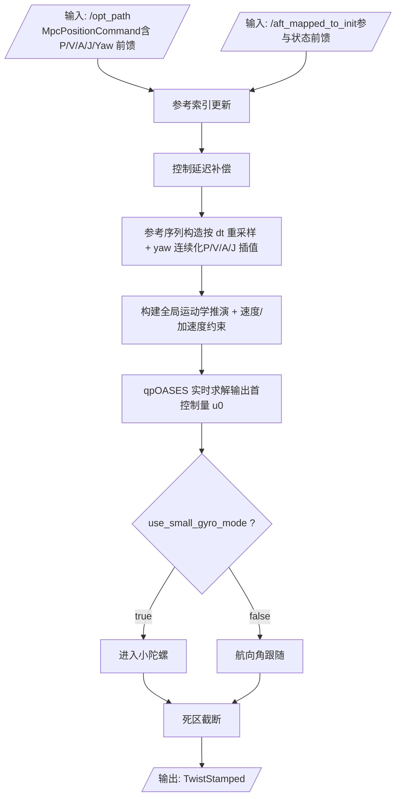

# minco_controller（RM 高动态底盘 Nav2 控制器）

`minco_controller` 是一个面向 RoboMaster（RM）等高动态地面机器人的 **Nav2 Controller 插件**，核心目标是：

- 吃满上游 `minco_planner` 的高频前馈（位置/速度/加速度/jerk/yaw）；
- 在 **全局坐标系** 直接进行 MPC 解算与约束处理；
- 以低延迟方式输出可执行速度指令，兼容 RM 战队常见“上层解算 + 底盘 MCU 二次映射”的控制架构。

插件导出类：`minco_controller::MincoMpcController`。

---

## 1. 项目简介

在整套导航链路中，本功能包定位为 **轨迹跟踪控制器**，每个控制周期完成：

1. 接收并缓存 `/opt_path`（`ros_interfaces::msg::MpcPositionCommand`）与 `/aft_mapped_to_init`；
2. 从前馈轨迹中构造时域对齐的参考序列；
3. 构建并求解带约束的 Condensed QP；
4. 结合战队策略分支（小陀螺 / 平动）输出 `TwistStamped`（全局速度）。


---

## 2. Mermaid 算法流程图（纵向数据流）



---

## 3. 核心控制流程详述

### 3.1 输入接入与坐标统一

- `/opt_path` 是主信息源，`cmds` 内包含位置、速度、加速度、jerk、yaw、yaw_rate 等高阶前馈；
- `/aft_mapped_to_init` 用于提供位姿参考（Pose），避免把延迟较大的速度估计直接灌入控制状态；
- 若 `opt_path.header.frame_id` 为空，回退 `map_frame`，随后统一变换到控制器工作坐标系（通常为 `global_frame_`）。

### 3.2 参考轨迹处理：防回退 + 延迟补偿

参考索引不是每帧“盲目最近点重定位”，而是：

1. 先做几何最近点与线段投影，得到 `nearest_idx_float`；
2. 再根据历史 `tracked_ref_idx_`、`tracked_ref_time_`、`trajectory_id` 做 **单调前向推进**；
3. 仅当轨迹 ID 切换时重置跟踪状态，防止重复发布时间戳导致“假回退”；
4. 通过 `control_delay_compensation` 把采样时刻整体前推，直接追踪“未来一点”的参考。

### 3.4 QP 建模与约束：全局系线性推演 + 差分加速度

`mpc_solver` 使用 Condensed QP：

$$
\min_U \frac{1}{2}U^T H U + g^T U
$$

其中：

- 状态堆叠：$X = A_{hat}x_0 + B_{hat}U$；
- 代价项：位置/航向误差权重 `Q` + 控制偏差权重 `R`；
- 约束项：速度盒约束 + 可选差分加速度约束。

差分加速度约束核心形式：

$$
a_{min} \cdot dt \le (v_k - v_{k-1}) \le a_{max} \cdot dt
$$

在全局坐标系下直接约束 `vx/vy/omega`，并把首步历史项并入边界。

### 3.5 输出处理：策略分支 + 安全截断

求解得到 `u_global` 后，控制器按战队模式分支：

- `use_small_gyro_mode = true`：角速度强制 `fixed_wz`（小陀螺）；
- `use_small_gyro_mode = false`：采用 MPC 求解 `omega` 并限幅；
- 最后做 `setSpeedLimit` 与 `deadzone_speed_threshold` 截断，输出稳定可落地的指令。

---

## 4. 核心参数说明（Nav2 YAML）

> 参数命名均为 `<controller_name>.*`，例如 `FollowPath.dt`。

| 参数 | 类型 | 典型值/默认值 | 调参建议 |
|---|---|---|---|
| `dt` | double | 0.05 | 控制周期。底盘算力足够时可适当减小。 |
| `lookahead_time` | double | 0.5 | **建议 0.6~0.8s**，高速对抗下兼顾预见性与可控性。 |
| `Q` | double[3] | `[5.0, 5.0, 2.0]` | RM 竞技建议显著提高位置项惩罚（x/y），强化贴轨与抢位。 |
| `R` | double[3] | `[1.0, 1.0, 0.5]` | RM 场景建议大幅减小速度惩罚，解除平移响应“封印”。 |
| `vx_min`, `vx_max` | double | `-1.0`, `1.0` | 全局 x 速度边界，按底盘实际极限与供电状态设定。 |
| `vy_min`, `vy_max` | double | `-1.0`, `1.0` | 全局 y 速度边界，麦轮/全向盘建议与 x 同级别。 |
| `omega_min`, `omega_max` | double | `-2.0`, `2.0` | 角速度边界，平动模式下生效。 |
| `use_acc_constraints` | bool | `false` | 建议实车开启并联调，可显著改善突变指令可执行性。 |
| `ax_min`, `ax_max` | double | `-2.0`, `2.0` | x 向加速度边界。 |
| `ay_min`, `ay_max` | double | `-2.0`, `2.0` | y 向加速度边界。 |
| `alpha_min`, `alpha_max` | double | `-4.0`, `4.0` | 角加速度边界。 |
| `use_small_gyro_mode` | bool | `true` | 小陀螺总开关。 |
| `fixed_wz` | double | `0.0` | 小陀螺固定角速度(rpm)，建议按枪口稳定性与供电余量标定。 |
| `deadzone_speed_threshold` | double | `0.02` | 速度死区阈值，抑制低速抖动与电机啸叫。 |
| `control_delay_compensation` | double | `0.25` | 控制延迟补偿时间，建议结合日志与高速回放标定。 |

---

## 5. 依赖与安装

### 5.1 依赖

- ROS 2 + Nav2（`nav2_core`, `nav2_util`, `nav2_costmap_2d`, `pluginlib`, `tf2_ros` 等）；
- Eigen3；
- qpOASES（系统安装优先，或工程内 third-party 版本）。

### 5.2 编译

```bash
colcon build --packages-select minco_controller --cmake-args -DCMAKE_BUILD_TYPE=Release
```

```bash
source install/setup.bash
```

---

## 6. ⚠️ 特殊注意

> ### 规则 1：全局坐标系速度输出（不旋转回 `base_link`）
> 受战队底盘 MCU 与上层控制架构约束，本 MPC **不会**把解算速度旋转回 `base_link`。求得的 `u_global(vx, vy)` 直接作为 `TwistStamped.linear.x/.y` 下发；全局到本地的力矩映射由底盘 MCU 完成。
>
> ### 规则 2：小陀螺模式 / 平动模式
> - **小陀螺模式（`use_small_gyro_mode = true`）**：屏蔽 MPC 求得角速度，强制输出 `fixed_wz`，实现“平移与旋转解耦”的高压机动。
> - **平动模式（`use_small_gyro_mode = false`）**：采用 MPC 的 `u_global.omega`，适用于常规指向跟随和姿态控制。

---
