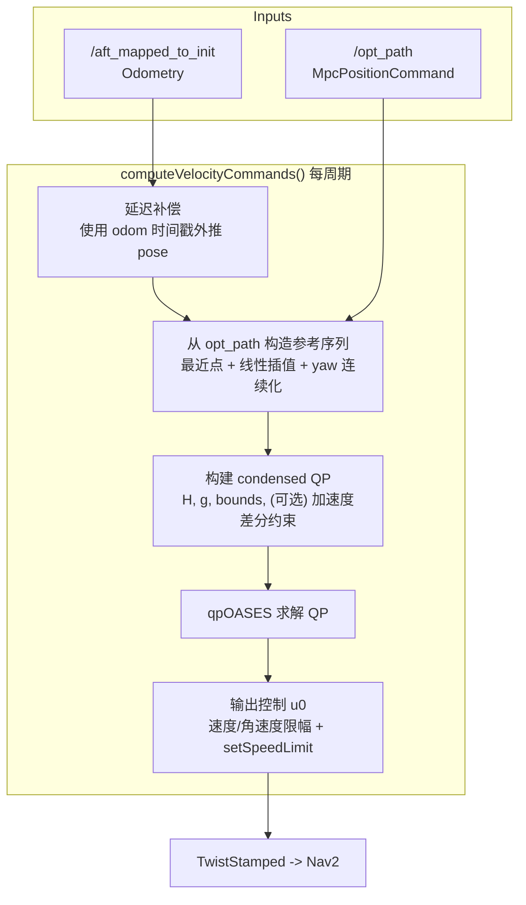

# BIT minco_controller

`minco_controller` 是一个面向地面移动机器人的 **Nav2 Controller 插件**：
- 从上游 `minco_planner` 发布的 `/opt_path`（`ros_interfaces::msg::MpcPositionCommand`）中提取前瞻参考序列；
- 使用基于 qpOASES 的线性 MPC（condensed QP）实时求解速度控制量；
- 输出 `TwistStamped` 给 Nav2 控制链路，并提供预测/实际轨迹可视化。

> 插件导出：`minco_controller::MincoMpcController`（见 `minco_controller.xml`）。

---

## 1. 功能包简介

在导航系统中，`minco_controller` 的定位是 **轨迹跟踪控制器**：

- **输入**
  - 上游规划：`/opt_path`（位置/速度/加速度/jerk/yaw 等前馈信息序列）。
  - 状态估计：`/aft_mapped_to_init`（里程计，含线速度与角速度，用于延迟补偿）。
  - TF：用于将 `/opt_path` 的坐标系转换到控制器的工作坐标系。

- **输出**
  - Nav2 控制输出：`geometry_msgs::msg::TwistStamped`。
  - 可视化：预测轨迹 `/mpc_predict_path` 与实际轨迹 `/mpc_real_path`。

---

## 2. Mermaid 流程图（算法与数据流）



---

## 3. 算法工作流程（整体详细、局部简述）

本节按“数据接入 → 参考构造 → QP 建模 → 求解与输出”的顺序说明。

### 3.1 数据接入与缓存

- 订阅 `/opt_path`：缓存最新一帧 `MpcPositionCommand`（`cmds` 为离散时间序列）。
- 订阅 `/aft_mapped_to_init`：缓存最新里程计，用于对控制周期内的 **感知/通讯延迟** 做简单补偿。

### 3.2 坐标系转换（opt_path → 控制坐标系）

`/opt_path` 可能来自 `map` 等坐标系，而控制器通常在 costmap 的 `global_frame_` 下工作。

- 若 `opt->header.frame_id` 为空，则默认使用 `map_frame` 参数；
- 通过 TF 查询 `target_frame <- source_frame` 的变换；
- 对每个 `PositionCommand`：
  - 位置点 `PointStamped` 做变换；
  - 速度向量 `Vector3Stamped` 做变换；
  - 航向 `yaw` 按变换的 yaw 差进行叠加并归一化。

### 3.3 参考序列构造（最近点 + 时间对齐 + 插值）

目标：从高频离散的 `/opt_path.cmds` 中提取长度为 `horizon` 的参考序列 `ref[k]`。

1) **最近点搜索**：在 `cmds` 中寻找与当前状态最近的索引 `best_idx`。
2) **轨迹段投影**：将机器人位置投影到 `best_idx -> best_idx+1` 线段上，得到连续索引 `current_idx_float`（并 clamp 到非负，避免 size_t 转换溢出）。
3) **时间对齐**：
   - 规划器频率 `planner_dt = 1 / planner_freq`（默认与 `minco_planner.opt_freq` 一致）；
   - 用 `current_traj_time = current_idx_float * planner_dt` 作为参考时间原点。
4) **按 MPC dt 采样**：
   - `target_time = current_traj_time + k * mpc_dt`；
   - 线性插值 `pos/vel/yaw/yaw_rate` 得到 `ReferencePoint`。
5) **yaw 连续化**：
   - 首点 yaw 对齐到当前 yaw 的邻域；
   - 后续点逐步展开，避免 $\pi$ 跳变。

### 3.4 MPC 模型与代价（condensed QP）

#### 3.4.1 离散线性模型（按参考 yaw 线性化）

状态：$x=[p_x, p_y, \psi]$，控制（决策变量）：body 系 $u=[v_x, v_y, \omega]$。

单步模型：

$$
\begin{aligned}
 p_x^{k+1} &= p_x^k + (v_x\cos\psi_r - v_y\sin\psi_r)\,dt \\
 p_y^{k+1} &= p_y^k + (v_x\sin\psi_r + v_y\cos\psi_r)\,dt \\
 \psi^{k+1} &= \psi^k + \omega\,dt
\end{aligned}
$$

其中 $\psi_r$ 取参考轨迹的 yaw。

#### 3.4.2 condensed QP 形式

将 horizon 内的控制量堆叠为 $U\in\mathbb{R}^{3N}$，得到：

$$\min_U\ \frac{1}{2}U^T H U + g^T U$$

- 代价由状态跟踪误差 $Q$ 与控制偏差 $R$ 组成；
- 参考控制 $U_{ref}$ 直接来自参考轨迹的 map/global 速度。

#### 3.4.3 约束

- **速度约束（box bounds）**：对每步的 $v_x, v_y, \omega$ 设置上下界。
- **可选加速度约束（差分约束）**：
  - 形式：$a_{min}\,dt \le (v_k - v_{k-1}) \le a_{max}\,dt$；
  - $k=0$ 使用上一周期控制 `last_u_global_` 作为已知常数完成约束平移。

#### 3.4.4 数值稳定

- Hessian 添加正则项：`eps_regularization * I`，降低奇异/病态风险。

### 3.5 求解与输出

- 使用 qpOASES 的 `QProblem` 求解 QP；
- 取第一个控制量 $u_0$ 作为当前周期输出；
- 求解器直接输出 map/global 速度（插件层再转换到 base 坐标系）；
- 支持 Nav2 `setSpeedLimit`：对输出速度做幅值缩放。

---

## 4. 可视化模块简介

本包提供轻量可视化：
- `/mpc_predict_path`：发布 MPC 预测轨迹（map/global_frame）。
- `/mpc_real_path`：发布实际行走轨迹历史（默认 1Hz 降频，带简单距离滤波）。

用于对齐 `/opt_path`、观察跟踪误差、诊断 QP 不可行等问题。

---

## 5. 参数配置说明

参数以 Nav2 插件名称为前缀（`<controller_name>.*`）。下面以 `<controller_name> = minco_controller` 举例。

### 5.1 时间与 horizon

| 参数 | 类型 | 默认值 | 说明 |
|---|---:|---:|---|
| `dt` | double | 0.05 | MPC 控制周期（秒）。 |
| `lookahead_time` | double | 0.5 | 预测总时长（秒），`horizon = ceil(lookahead_time/dt)`。 |
| `horizon` | int | 10 | 预留：当前实现会根据 `lookahead_time/dt` 覆盖该值。 |

> 注意：源码中 `lookahead_time` 会被读取但未显式 declare；若你使用严格参数声明模式，建议在配置文件中显式提供该参数。

### 5.2 代价权重

| 参数 | 类型 | 默认值 | 说明 |
|---|---:|---:|---|
| `Q` | double[3] | [5.0, 5.0, 2.0] | 状态误差权重，对应 [x, y, yaw]。 |
| `R` | double[3] | [1.0, 1.0, 0.5] | 控制误差权重，对应 [vx, vy, omega]。 |

### 5.3 速度/角速度约束（body 系）

| 参数 | 类型 | 默认值 | 说明 |
|---|---:|---:|---|
| `vx_min` / `vx_max` | double | -3.0 / 3.0 | x 方向速度边界。 |
| `vy_min` / `vy_max` | double | -3.0 / 3.0 | y 方向速度边界。 |
| `omega_min` / `omega_max` | double | -2.0 / 2.0 | 角速度边界。 |

### 5.4 可选加速度约束

| 参数 | 类型 | 默认值 | 说明 |
|---|---:|---:|---|
| `use_acc_constraints` | bool | false | 是否启用差分加速度约束。 |
| `ax_min` / `ax_max` | double | -2.0 / 2.0 | vx 的加速度边界（m/s²）。 |
| `ay_min` / `ay_max` | double | -2.0 / 2.0 | vy 的加速度边界（m/s²）。 |
| `alpha_min` / `alpha_max` | double | -4.0 / 4.0 | omega 的角加速度边界（rad/s²）。 |

### 5.5 坐标系

| 参数 | 类型 | 默认值 | 说明 |
|---|---:|---:|---|
| `odom_frame` | string | camera_init | 兜底 odom frame（当 `global_frame_` 为空时）。 |
| `map_frame` | string | map | 当 `/opt_path.header.frame_id` 为空时使用。 |

---

## 6. 依赖与安装

### 6.1 主要依赖

- ROS 2 + Nav2：`nav2_core`, `nav2_util`, `nav2_costmap_2d`, `pluginlib`, `tf2_ros` 等。
- Eigen3。
- qpOASES：优先使用系统安装；若未找到，会自动编译并链接 `third_party/qpOASES`。

### 6.2 编译

在工作区根目录使用 colcon 构建：

```bash
colcon build --packages-select minco_controller --cmake-args -DCMAKE_BUILD_TYPE=Release
```

运行前加载环境：

```bash
source install/setup.bash
```

### 6.3 Nav2 配置示例（片段）

> 以下为示意，请按你的 controller_server 配置调整。

```yaml
controller_server:
  ros__parameters:
    controller_plugins: ["FollowPath"]
    FollowPath:
      plugin: "minco_controller::MincoMpcController"
      dt: 0.05
      lookahead_time: 0.5
      planner_freq: 20.0
      Q: [5.0, 5.0, 2.0]
      R: [1.0, 1.0, 0.5]
      vx_min: -1.0
      vx_max:  1.0
      vy_min: -1.0
      vy_max:  1.0
      omega_min: -2.0
      omega_max:  2.0
      use_acc_constraints: false
      odom_frame: "camera_init"
      map_frame: "map"
```

---

## 7. 测试效果展示

- [ ] 典型路径跟踪截图（/mpc_predict_path vs /mpc_real_path）
- [ ] 跟踪误差统计（横向/航向误差、速度误差）
- [ ] qpOASES 求解耗时与失败率
---

使用注意：
- 本控制器依赖 `/opt_path` 的高频前馈信息；若上游未发布或坐标系 TF 不可用，会输出零速度。
- 当前实现默认将求解得到的 map 系速度直接作为 base 输出（未再旋转到 base_link）；如你的底盘速度接口严格要求 base 系，请在集成时确认坐标系约定。
