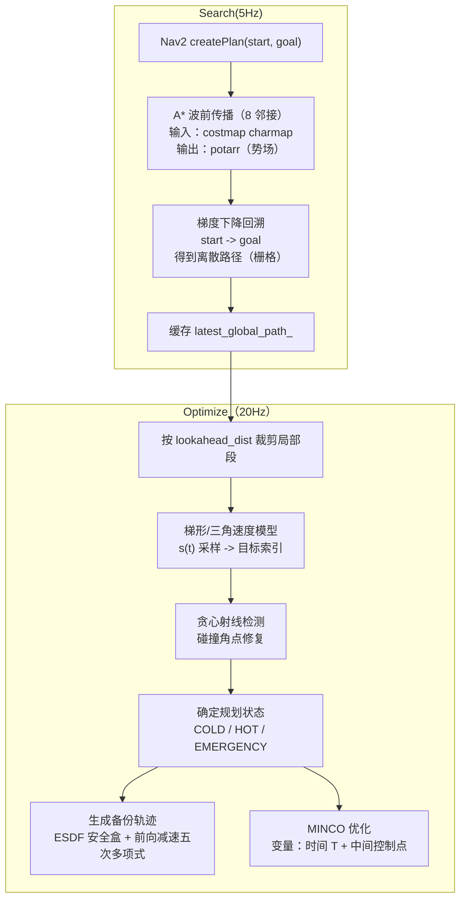

# BIT minco_planner
## DreamChaser
`minco_planner` 是一个面向地面移动机器人的 **Nav2 GlobalPlanner 插件**：
- 上层以 A* 在 costmap 栅格上生成离散全局引导路径（nav_msgs/Path）。
- 下层以固定频率在局部前瞻窗口内进行路径裁剪、稀疏化与安全修复，并调用 MINCO 轨迹优化器生成可执行的平滑轨迹。
- 同时提供可视化模块（路径 / 控制点 / ESDF 点云）与安全备份轨迹（刹停/缓停）。

> 插件导出：`minco_planner::MincoPlanner`（见 `global_planner_plugin.xml`）。

---

## 1. 功能包简介

在整个导航系统中，`minco_planner` 的角色可以概括为：

1) **全局路径生成（离散引导）**
- 输入：Nav2 的起点/终点、`nav2_costmap_2d::Costmap2D` 栅格地图。
- 输出：一条基于 A* 的离散路径 `nav_msgs::msg::Path`。

2) **局部前瞻段优化（可执行轨迹）**
- 将全局离散路径按机器人当前位置截取一个前瞻距离范围内的局部段；
- 用梯形/三角速度模型对弧长做均匀时间采样，得到“理想稀疏节点”；
- 用贪心射线检测（costmap 直线采样）验证可直连性，若碰撞则插入“角点”修复；
- 将修复后的稀疏节点送入 MINCO 优化器，输出一条平滑、动态可行的轨迹；
- 同时生成备份安全轨迹（在 ESDF 安全盒内的前向减速/刹停轨迹）。

3) **运行期输出**
- 发布 MPC 位置指令序列（优化轨迹 / 备份轨迹）。
- 发布可视化话题（A* 路径、控制点、优化/备份路径、ESDF 点云）。

---

## 2. Mermaid 流程图（算法与数据流）



---

## 3. 算法工作流程

本节按“从一次规划请求到运行期持续优化”的顺序描述。

### 3.1 A* 离散路径搜索（全局引导）

触发点：Nav2 调用 `createPlan(start, goal)`。

1) **坐标与合法性检查**
- 将 start/goal 从 world 坐标映射到 costmap 栅格坐标；
- 当 `tolerance==0` 且 goal 落入 LETHAL 代价时拒绝；
- 清空机器人所在栅格（避免起点被自身占用代价影响）。

2) **A* 波前传播（从 goal 反向扩展势场）**
- 实现位于 `minco_core/astar.cpp`：
  - 从 goal 位置初始化 `potarr[goal]=0`，并以三缓冲队列（`curP/nextP/overP`）推进；
  - 8 邻接扩展，直走/斜走使用不同距离系数（对角线更贵）；
  - 栅格代价融合：`new_pot = pot(cur) + COST_NEUTRAL*dist + cost(cell)*COST_FACTOR*dist`；
  - 障碍判定：LETHAL/INSCRIBED（>=253）直接跳过；UNKNOWN(255) 可由 `allow_unknown` 控制。

3) **势场回溯得到离散路径**
- 从 start 位置沿势场做 8 邻接“梯度下降”，每次选择 `potarr` 更小的邻居；
- 写入 `pathx/pathy` 缓冲并最终转换到 world 坐标写入 `nav_msgs::Path`；
- 同时缓存到 `latest_global_path_`，供运行期局部优化使用。

> 说明：当前代码中 `use_astar` 已声明参数，但在 `makePlan()` 内仍固定走 A* 分支（属于预留开关）。

### 3.2 基于前瞻距离的局部裁剪（运行期）

触发点：`MincoFSM` 的 20Hz 主循环在 `FOLLOW_TRAJ` 中按需触发 `MincoPlanner::ReplanLocal()`。
（异步安全检测：`MincoPlanner::safetyTimerCallback()` 以 20Hz 检查当前已提交轨迹是否与 costmap 冲突。）

1) 获取当前机器人位姿（`costmap_ros_->getRobotPose`）。
2) 在 `latest_global_path_` 上搜索距当前位置最近的点作为起点索引。
3) 从该索引向前累积距离，直到达到 `lookahead_dist`，得到局部“稠密路径段”。

### 3.3 梯形加减速采样 + 贪心射线检测碰撞 + 插值修复（稀疏化）

目标：把局部稠密路径转成较少但“可直连/更适合优化”的稀疏节点序列。

1) **弧长累计**
- 计算局部路径点的累计弧长 `accumulated_dist`，得到总长度 `L`。

2) **梯形/三角速度模型（整体思路）**
- 依据参考速度 `v_ref = 0.8 * max_vel` 与参考加速度 `a_ref = max_acc`：
  - 若 `L` 足够长：采用梯形速度曲线（加速-匀速-减速）；
  - 否则：退化为三角速度曲线（加速-减速）。
- 根据总时间 `t_total`，以固定时间间隔对 `t` 采样，计算 `s(t)`（弧长位置），再映射回原始路径索引。

3) **贪心射线检测（isLineFree）**
- 对每一段候选“直连边”做 costmap 直线离散采样：
  - 以 costmap 分辨率为步长采样线段；
  - 任一点落入 `INSCRIBED_INFLATED_OBSTACLE`（及以上）即判定不可直连。

4) **碰撞修复（插入角点）**
- 若当前安全点到目标点不可直连：
  - 在区间内寻找“偏离直线最大”的点作为角点（近似提取转角/绕障节点）；
  - 插入角点后继续尝试直连，直到修复成功或达到迭代上限。

最终输出：稀疏节点 `sparse_path`（含起点与终点）。

### 3.4 MINCO 轨迹优化（核心求解）

1) **规划状态机（HOT/COLD/EMERGENCY）**
- 若无历史轨迹：COLD_START（速度/加速度置 0）；
- 若有历史轨迹：
  - 时间 t 合法（在上一次轨迹持续时间内）；
  - 位置误差不超过阈值（>0.5m 触发 EMERGENCY_STOP）；
  - 速度方向与新路径初段夹角不过大（点积 <0.9 则退回 COLD_START）。
- HOT_START：用上一次轨迹在 t 时刻的 P/V/A 作为新的起始状态。

2) **终端状态设置（靠近全局目标则收敛停车）**
- 计算稀疏终点与全局目标距离：
  - 若距离 > 1m：终端速度沿末段切向给定 `0.8*max_vel`（鼓励持续前进）；
  - 否则：终端速度与加速度置 0（停车/收敛）。

3) **MINCO 优化变量与求解器**
- 优化器：`MincoOptimizer`（内部使用 `lbfgs`）。
- 变量：
  - 时间变量（通过 `tau -> T` 的指数映射保证 `T>0`）；
  - 中间控制点（稀疏路径中除首尾外的点）。

4) **代价项（costFunctional）概述**
总代价由两部分组成：

- **MINCO 内部能量项（平滑度）**
  - 由 `MINCO_S3NU` 提供 `getEnergy()` 与对系数/时间的偏导；

- **约束/惩罚项（constraintsFunctional）**（按分段、按采样积分）
  - `Pos`：基于 ESDF 的安全距离惩罚（距离小于 `safe_dist` 时增长，使用 `smooth_eps` 平滑）；
  - `Vel`：速度上界惩罚（超过 `max_vel` 时增长）；
  - `Acc`：加速度上界惩罚（超过 `max_acc` 时增长）；
  - `Attract`：轨迹对“引导节点/航点”的吸引项（鼓励贴合稀疏路径）。

- **时间正则项**
  - `rho * sum(T)`：鼓励更短的总时长（避免无限慢）。

5) **输出**
- 优化得到的轨迹会以固定步长采样为 `ros_interfaces::msg::MpcPositionCommand`，发布到 `/opt_path`。

### 3.5 备份轨迹（安全兜底）

即使主优化成功，也会每周期先构造并发布一条安全备份轨迹：

1) 从 ESDF 在当前位置估计安全距离，构造轴对齐“安全盒”（SFC）。
2) 在安全盒内，沿当前速度方向生成一条“前向减速到停”的五次多项式轨迹候选（多组 T 候选）。
3) 若采样点全部落在安全盒内则接受；否则回退为原地短停轨迹。
4) 发布到 `/backup_path`（command_flag = BLOCK）。

---

## 4. Visualizer 简介（可视化模块）

`Visualizer` 负责把规划过程中的关键中间量以 RViz 友好的形式发布出来，便于调参和定位问题。

已提供话题（默认）：
- `/astar_path_vis`：A* 离散路径（nav_msgs/Path，transient_local）。
- `/opt_path_vis`：优化轨迹采样成的 Path（nav_msgs/Path）。
- `/backup_path_vis`：备份轨迹采样成的 Path（nav_msgs/Path）。
- `/minco_control_points_vis`：控制点/稀疏节点（Marker，SPHERE_LIST，transient_local）。
- `/esdf_cloud`：ESDF 点云（PointCloud2，仅在成功加载静态 ESDF 且订阅者存在时，按 1Hz 发布）。

---

## 5. 参数配置说明

所有参数均以 Nav2 插件名称为前缀（`<planner_name>.*`）。下面以 `<planner_name> = minco_planner` 举例。

### 5.1 全局规划/运行期

| 参数 | 类型 | 默认值 | 说明 |
|---|---:|---:|---|
| `tolerance` | double | 0.5 | Nav2 目标容忍半径（当前实现主要用于 goal 校验逻辑）。 |
| `use_astar` | bool | true | 预留开关（当前 `makePlan()` 仍固定走 A*）。 |
| `allow_unknown` | bool | true | A* 是否允许 UNKNOWN 栅格（255）。 |
| `minco_optimizer.opt_freq` | double | 20.0 | 运行期优化定时器频率（Hz）。 |
| `minco_optimizer.lookahead_dist` | double | 5.0 | 从机器人当前位置向前截取的前瞻距离（米）。 |

### 5.2 静态 ESDF(static_esdf)

| 参数 | 类型 | 默认值 | 说明 |
|---|---:|---:|---|
| `esdf_pcd_path` | string | `src/utils/pcd2esdf/maps/2026_esdf.pcd` | 静态 ESDF PCD 文件路径。 |
| `esdf_resolution` | double | 0.05 | ESDF 栅格分辨率（米）。 |

### 5.3 MINCO 优化器(minco_optimizer)

| 参数 | 类型 | 默认值 | 说明 |
|---|---:|---:|---|
| `.safe_dist` | double | 0.3 | ESDF 安全距离阈值（米）。 |
| `max_vel` | double | 2.0 | 速度上界（m/s）。 |
| `max_acc` | double | 4.0 | 加速度上界（m/s²）。 |
| `time_allocation_iters` | int | 15 | 预留：时间分配迭代次数（当前实现中以 L-BFGS 优化为主）。 |
| `penalty_weight_time` | double | 0.01 | 时间正则权重 `rho`（越大越倾向更短时长）。 |
| `smooth_eps` | double | 0.01 | ESDF 惩罚平滑参数（避免不可导）。 |
| `integral_res` | int | 16 | 每段轨迹的积分采样分辨率（越大越精细但更耗时）。 |
| `opt_accuracy` | double | 1e-4 | L-BFGS 梯度收敛阈值。 |
| `print_optimizer_log` | bool | true | 输出优化过程日志（代价分解、迭代次数等）。 |
| `penalty_weight_pos` | double | 1000.0 | 位置/安全距离惩罚权重。 |
| `penalty_weight_vel` | double | 1000.0 | 速度超限惩罚权重。 |
| `penalty_weight_acc` | double | 10000.0 | 加速度超限惩罚权重。 |
| `penalty_weight_att` | double | 1000.0 | 吸引项（贴合引导路径）权重。 |

---

## 6. 依赖与安装

### 6.1 主要依赖

- ROS 2 + Nav2：`nav2_core`, `nav2_costmap_2d`, `nav2_util`, `pluginlib`, `tf2_ros` 等。
- 点云库：PCL（用于包内相关模块链接）。
- Eigen3。

此外，本包在 `include/` 内部包含（或封装）了一些工具库/头文件（如 fmt/cereal/lbfgs 等），减少外部依赖。

### 6.2 编译

在工作区根目录使用 colcon 构建：

```bash
colcon build --packages-select minco_planner --cmake-args -DCMAKE_BUILD_TYPE=Release
```

运行前加载环境：

```bash
source install/setup.bash
```

### 6.3 Nav2 配置示例（片段）

> 以下为示意，具体请根据你的 Nav2 配置文件/启动文件调整插件名与命名空间。

```yaml
planner_server:
  ros__parameters:
    planner_plugins: ["GridBased"]
    GridBased:
      plugin: "minco_planner/MincoPlanner"
      tolerance: 0.5
      allow_unknown: true
      minco_optimizer:
        opt_freq: 20.0
        lookahead_dist: 5.0
        safe_dist: 0.3
        max_velocity: 2.0
        max_acceleration: 4.0
        penalty_weight_time: 0.01
        penalty_weight_pos: 1000.0
        penalty_weight_vel: 1000.0
        penalty_weight_acc: 10000.0
        penalty_weight_att: 1000.0
      static_esdf:
        esdf_pcd_path: "src/utils/pcd2esdf/maps/2026_esdf.pcd"
        esdf_resolution: 0.1
```

---

## 7. 测试效果展示

- **典型参数与性能数据**
- **RViz 可视化截图**
<table>
  <tr>
    <td align="center">
      
    </td>
    <td align="center">
      
    </td>
  </tr>
</table>

---

## 8. 参考文献

- [MINCO](https://arxiv.org/abs/2103.00190)-Geometrically Constrained Trajectory Optimization for Multicopters
- [中国科学技术大学（USTC）2025 哨兵技术报告](https://bbs.robomaster.com/article/803727?source=4)
- [GCOPTER](https://github.com/ZJU-FAST-Lab/GCOPTER) – A valuable resource that efficiently performs differentiable trajectory optimization and serves as the foundation of our trajectory optimization method.
- [SUPER](https://github.com/hku-mars/SUPER): Safety-assured High-speed Navigation for MAVs

---

## 9. 版权与交流方式

- 版权/许可：请以仓库根目录 LICENSE 为准；本包内 `include/` 可能包含第三方库的 LICENSE 文件，请一并遵循。
- 交流与反馈：
  - Maintainer: alioth
  - Email: 15207309998@163.com
  - QQ:2914335251

使用注意：
- 本包默认输出 `/opt_path` 与 `/backup_path` 的 `ros_interfaces::msg::MpcPositionCommand`，请确保下游控制器/桥接节点订阅并理解字段含义。
- ESDF 静态地图加载失败时仍可运行，但安全相关能力会受限（例如备份轨迹的安全盒与 ESDF 可视化）。
