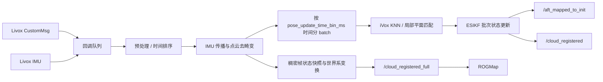

# 🛰️ Point-LIO ROS 2

> 面向 Livox MID-360 与高速旋转哨兵场景的高频激光惯性里程计组件，提供去畸变定位、稠密世界系点云和低开销进程内感知链路。

[返回项目主页](../../../README.md) · [Livox Driver](../livox_ros_driver2/README.md) · [ROGMap](../rog_map/README.md)

## ✨ 本仓库版本亮点

- ROS 2 Component 化，可与 Livox Driver、Planner/ROGMap 部署在同一多线程容器。
- `CustomMsg::UniquePtr` 输入与 `PointCloud2::UniquePtr` 输出，为进程内零拷贝/少拷贝提供必要条件。
- 原始点云、滤波定位点云与 `/cloud_registered_full` 稠密点云职责分离。
- 稠密点云按点时间稳定排序，结合状态快照进行去畸变并变换到世界系。
- “最新完整帧”发布采用 SensorData QoS `keep_last(1)`，减少旧大消息排队。
- 支持双雷达融合输入，由驱动层完成时间窗聚合与外参变换。
- 增加 `blind_center`，可将近场盲区中心对齐到实际底盘中心。
- 独立工作线程分离 ROS 回调与主 LIO 处理，降低高频调度互相阻塞。

> `UniquePtr + intra-process` 能显著减少同进程消息拷贝，但是否达到完全零拷贝还取决于 ROS 2 中间件、发布/订阅类型和容器部署方式。

## 🔄 模块流程图



### 流程概述

LiDAR/IMU 回调先写入 pending 队列，mapping worker 完成同步、预处理和去畸变。定位点云经体素降采样后按点时间组成 batch；每个 batch 传播到末端时刻，以其中全部点执行 iVox 最近邻搜索、局部平面匹配和一次 ESIKF 更新。成功状态按传感器时间限频发布 odom/TF。完整点云链路独立保留预处理有效点，通过状态快照分段补偿后发布给 ROGMap，不因定位 batch 合并而删点。

## 🧪 技术方向

- 以 IMU 传播和点到局部平面残差完成高频激光惯性状态估计。
- `pose_update_time_bin_ms` 将相邻点时间合并为状态更新 batch；当前比赛配置为 `2.0 ms`，`0.0` 可恢复逐时间戳更新。
- 每个 batch 仍遍历该组全部定位点，调用 iVox KNN 并构造有效平面约束；batch 改变的是状态更新粒度，不是简单丢点。
- odom 只在成功状态更新后按传感器时间限频发布；当前配置目标为 `100 Hz`。
- `/cloud_registered_full` 使用独立状态快照完成完整点云去畸变和世界系变换，为地图保留更充分的观测。

## ⚡ 性能方向

- Livox driver 与 Point-LIO 部署在同一 `component_container_mt`，点云输入采用 `CustomMsg::UniquePtr`，降低大消息序列化和复制。
- `/cloud_registered_full` 使用 `PointCloud2::UniquePtr` 移动发布和 `SensorDataQoS().keep_last(1)`，下游过载时优先丢旧帧。
- 定位点云可降采样，完整地图点云单独发布；避免为了地图密度让所有原始点进入滤波更新。
- 2 ms batch 减少 ESIKF 更新次数和状态发布调度，但 iVox 最近邻搜索仍按 batch 内点执行。
- `RuntimeStatistics` 总开关控制 IMU、状态、逐帧性能 CSV 和低频摘要；关闭时不创建日志文件，也不执行新增阶段计时。

## 📡 ROS 接口

### 输入

| Topic | 类型 | 说明 |
|---|---|---|
| `livox/lidar` | `livox_ros_driver2/msg/CustomMsg` | 单雷达或驱动层融合后的点云 |
| `livox/imu_192_168_1_135` | `sensor_msgs/msg/Imu` | 当前主雷达 IMU，名称取决于雷达 IP |

### 输出

| Topic | Frame | 说明 |
|---|---|---|
| `/aft_mapped_to_init` | `camera_init` → `body` | 高频 LIO 里程计 |
| `/cloud_registered` | `camera_init` | 定位/可视化注册点云 |
| `/cloud_registered_full` | `camera_init` | 稠密、去畸变、世界系完整帧，ROGMap 主输入 |
| `/cloud_registered_body` | `body` | 机体系注册点云 |
| `/Laser_map` | `camera_init` | 累积地图 |
| `/path` | `camera_init` | 里程计路径 |

启用 TF 发布后，模块发布 `camera_init → body`，并按项目约定提供 `camera_init → base_link`、`camera_init → slambase`。这些变换含项目特定安装补偿，改变雷达位置时必须核对源码与下游 frame 约定。

## ⚙️ 关键配置

主配置：`config/mid360.yaml`。

### 输入与 IMU

```yaml
common:
  lid_topic: "livox/lidar"
  imu_topic: "livox/imu_192_168_1_135"
  use_imu_as_input: false
  prop_at_freq_of_imu: true
```

雷达 IP 改变后，驱动生成的逐雷达 IMU topic 也会改变；必须同步修改 `imu_topic`。

### 🎯 Blind 中心

```yaml
preprocess:
  blind: 0.35
  blind_center_enable: true
  blind_center: [0.0, 0.20, 0.0]
```

传统盲区以雷达原点为中心。本项目允许把盲区中心平移到底盘中心附近，避免安装偏置导致车体近场点在不同方向被不一致地保留。`blind_center` 是预处理距离判断中心，不是 TF，也不会替代正确外参。

### 📐 Lidar–IMU 外参

```yaml
mapping:
  extrinsic_est_en: false
  extrinsic_T: [-0.011, -0.02329, 0.04412]
  extrinsic_R: [1.0, 0.0, 0.0,
                0.0, 1.0, 0.0,
                0.0, 0.0, 1.0]
```

比赛配置关闭在线外参估计，依赖离线标定值。平移单位为米，旋转矩阵需保持正交。错误外参会表现为旋转时地图重影、墙面弯曲和 odom 漂移。

### 发布与地图

| 参数 | 作用 |
|---|---|
| `publish.tf_send_en` | 发布 LIO TF |
| `publish.scan_publish_en` | 发布注册点云 |
| `publish.dense_publish_en` | 保留更稠密的输出 |
| `publish.scan_bodyframe_pub_en` | 发布机体系点云 |
| `publish_accumulated_map` | 发布累积地图 |
| `publish.accumulated_map_publish_hz` | 限制大地图发布频率 |
| `pcd_save.pcd_save_en` | 保存 PCD；会产生磁盘开销 |

### Batch、iVox 与 odom

| 参数 | 当前配置 | 作用 |
|---|---:|---|
| `mapping.pose_update_time_bin_ms` | `2.0` ms | ESIKF 时间 batch；`0.0` 恢复逐时间戳更新 |
| `mapping.ivox_grid_resolution` | `2.0` m | iVox 体素尺度，直接影响单体素点密度和邻域搜索 |
| `filter_size_map` | `0.5` m | 地图代表点分辨率；默认 iVox 每个该尺度子栅格只保留一个靠近中心的代表点 |
| `ivox_nearby_type` | `6` | 搜索中心体素及 6 邻域；可选 0/6/18/26 |
| `odometry.publish_frequency_hz` | `100` Hz | 成功状态更新上的传感器时间发布限频 |
| `runtime_pos_log_enable` | `false` | 全部运行时日志、CSV 和统计摘要总开关 |
| `runtime_log_path` | 空 | 空值写入 `ROOT_DIR/Log`，也可配置绝对/相对路径 |

## 🚀 推荐启动

单/双 MID-360 与 Point-LIO 的推荐组合入口位于 Point-LIO launch 目录：

```bash
ros2 launch point_lio mixed_livox_pointlio_intra_process.launch.py
```

该 launch 将驱动与 Point-LIO 放入同一 `component_container_mt` 并开启 intra-process。若拆分到不同进程，功能仍可运行，但大点云将经过 DDS 序列化链路。

启动后检查：

```bash
ros2 topic hz /aft_mapped_to_init
ros2 topic hz /cloud_registered_full
ros2 topic info /cloud_registered_full --verbose
ros2 run tf2_ros tf2_echo camera_init body
```

## ⚡ 稠密点云性能设计

`/cloud_registered_full` 的处理重点不是简单“多发一份点云”，而是保证下游可用性：

1. 对帧内点按相对时间稳定排序。
2. 保存与点云对应的滤波器状态快照。
3. 将各点补偿到统一时刻并转换到 `camera_init`。
4. 丢弃过旧、乱序和非有限点，避免污染地图。
5. 以 `UniquePtr` 发布，QoS 仅保留最新帧。

这条链路针对高速小陀螺运动尤其重要：点时间、去畸变和姿态传播任何一项错误，都会把静态墙面拉成动态障碍。

## 📈 性能统计

开启 `runtime_pos_log_enable` 后，`RuntimeStatistics` 在 `runtime_log_path` 下统一生成：

| 文件 | 内容 |
|---|---|
| `performance.csv` | LiDAR 积压、队列长度、点数、batch/状态/odom 次数、阶段耗时、地图规模和 iVox 统计 |
| `imu_pbp.txt` | IMU 原始/校正时间、到达间隔、异常状态、六轴数据和 pending 队列 |
| `mat_out.txt` | 状态矩阵日志 |
| `pos_log.txt` | 位姿状态日志 |

`performance.csv` 重点字段包括预处理/整帧处理/完整去畸变/地图增量/各类发布耗时，EKF batch 尝试、成功、失败、点数与耗时，以及每 20 个处理帧采样一次的 iVox 有效体素数、单体素点数均值/最大值/标准差和统计遍历耗时。

该开关会增加文件 IO、互斥和低频 iVox 全图统计开销，只适合短时诊断；现场常态运行保持关闭。

## ⚠️ 已知问题与改进方向

### Batch 是有界近似

当前每个 batch 使用组末状态处理组内点，相比逐点状态更新属于有界时间近似。它缓解了高频 EKF 更新和 odom 调度压力，但 batch 过大时会牺牲高速旋转场景的时序精度。完整点云仍保留全部预处理有效点，并不意味着定位状态也保持逐点更新。

### iVox 搜索与单体素点数边界

当前使用 `IVoxNodeType::DEFAULT`。其节点内 KNN 为线性候选搜索；每个 batch 的每个定位点仍会调用 `GetClosestPoint(..., NUM_MATCH_POINTS)`，在中心及所选邻域体素中收集候选。batch 只减少滤波更新次数，没有消除点级 iVox 搜索。

默认节点现在按照 `filter_size_map` 对地图点做二级子栅格去重，同一子栅格只保留一个更靠近中心的代表点。当前 `2.0 m / 0.5 m` 配置下，每个 iVox 体素最多保存 `4³ = 64` 个地图点；重复经过同一区域不会再让单体素点数无界增长。该约束只作用于定位地图，不改变完整去畸变点云。

现场验证应确认 `ivox_points_per_grid_max <= 64`，并继续关联 `ivox_points_per_grid_*`、`effective_feature_points`、batch 点数和 `ekf_update_ms`。若改变 `filter_size_map` 或 `ivox_grid_resolution`，单体素最大代表点数会随两者比例重新计算。

## 🛠️ 常见问题

| 现象 | 优先检查 |
|---|---|
| 收不到点云 | 雷达 IP、主机网卡、驱动 JSON、topic remap |
| 收到雷达但无 IMU | `imu_topic` 是否与主雷达 IP 生成的 topic 一致 |
| 原地转动地图重影 | 时间同步、IMU 外参、点时间单位与去畸变 |
| `/cloud_registered_full` 延迟增长 | 是否跨进程、QoS 队列、下游订阅是否阻塞 |
| 地图中心与车体错位 | 区分 `blind_center`、TF、Planner/Controller 杆臂参数 |
| 地面/高障碍进入 ROGMap 异常 | Point-LIO frame 与 ROGMap 投影 Z 范围 |
| CPU 占用过高 | 发布开关、降采样、累积地图/PCD、可视化订阅 |

## 🗂️ 关键源码

- `src/laserMapping.cpp`：LIO 主流程、odom/TF 与点云发布。
- `src/preprocess.cpp`：Livox 点云预处理、盲区与时间字段。
- `src/IMU_Processing.hpp`：IMU 传播和运动补偿。
- `config/mid360.yaml`：项目主参数。
- `launch/`：Point-LIO 独立或组合启动入口。

## 📚 延伸阅读

驱动网络、双雷达融合与组件部署见 [Livox Driver 文档](../livox_ros_driver2/README.md)；点云如何进入占据地图和 ESDF 见 [ROGMap 文档](../rog_map/README.md)。
