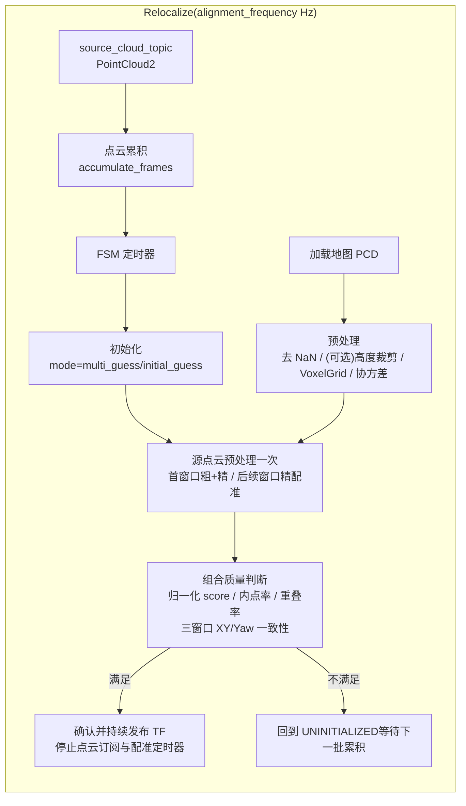

# BIT icp_relocalization
## DreamChaser

`icp_relocalization` 是一个面向激光点云的 **ROS2 GICP 重定位节点**：
- 离线加载地图点云（PCD），完成高度过滤（可选）、体素降采样、协方差和 KD-tree 预处理。
- 运行期累积点云，可使用全局网格多初值或参数初值，并按配置执行粗、精两阶段 GICP。
- 通过点数归一化质量、初值保护和多窗口 XY/Yaw 一致性确认结果，发布 TF；支持服务重新触发重定位。

> 节点：`gicp_relocalization_node`（可执行文件 `gicp_node`）。

---

## 1. 功能包简介

1) **地图侧预处理（离线）**
- 输入：`target_pcd_file` 指定的地图 PCD。
- 处理：去 NaN →（可选）高度裁剪 → VoxelGrid/协方差/KD-tree 预处理。

2) **在线重定位（运行期）**
- 输入：`source_cloud_topic` 指定的点云流；实车示例使用 `/cloud_registered_full`。
- 处理：累积 `accumulate_frames` 帧后触发一次对齐；根据 `mode` 使用全局多初值或参数初值。每个窗口只预处理一次源点云，首个确认窗口执行粗、精两阶段，后续窗口可复用已接受位姿直接精配准。

3) **输出**
- TF：`map_frame -> camera_init`（节点按 `tf_publish_frequency` 周期发布）。
- Debug 点云：地图、累积源点云、对齐后点云。

---

## 2. Mermaid 流程图（算法与数据流）



---

## 3. 算法工作流程

### 3.1 地图预处理（`GicpFilter::preprocessMap`）

1) 移除 NaN 点
2) 可选高度滤波（PassThrough on `z`）
3) VoxelGrid 下采样（地图侧 `gicp.target_voxel_leaf_size`）
4) 估计协方差并构建 KD-tree

### 3.2 初始化对齐（全局多初值或参数初值）

两种模式由 `mode` 控制：

1) `mode: multi_guess`
- 在 `INITIALIZING` 状态执行 `GicpFilter::initialAlign()`：
    - 根据 `search_rectangles`、`z_candidates` 和步长生成候选位姿
    - 对各候选执行 GICP，以归一化 score 选择满足内点率的最优结果
    - 可继续进入精配准阶段

2) `mode: initial_guess`
- 在 `UNINITIALIZED` 状态直接把 `initial_pose=[x,y,z,roll,pitch,yaw]` 转为初始矩阵（`map -> cloud_frame_id`），进入 `CONVERGING`。

### 3.3 GICP 精配准与收敛确认（`GicpFilter::align` + FSM）

1) 每次取一批累积点云作为 `source_cloud`
2) 以当前 `map_to_camera_init_` 为初值。首个确认窗口先用 `gicp.max_correspondence_distance` 粗配准，再用 `gicp.fine_alignment.max_correspondence_distance` 精配准；启用 `coarse_first_window_only` 后，后续稳定性窗口直接执行精配准
3) 检查归一化 score、内点率、几何重叠率；平面可观测性门限默认关闭但始终记录
4) `initial_guess` 模式下，首次定位还需满足相对参数初值的 XY/Yaw 修正范围
5) 至少三个独立点云窗口的结果满足最大两两 XY/Yaw 离散度后，选择窗口内 medoid 位姿作为最终结果：
- 发布 TF：`map_frame -> cloud_frame_id`
- 取消 FSM timer，并 `reset()` 激光订阅，停止后续计算

---

## 4. Visualizer 简介（可视化与验配）

该包主要通过点云话题来辅助验配：
- `~/debug/target_raw`、`~/debug/target_cropped`：目标地图点云
- `~/debug/source_raw`：源坐标系中的原始累积点云
- `~/debug/source_cropped`：源坐标系中经过高度过滤、ROI 裁剪和 source voxel 后的点云
- `~/debug/source_aligned`：将同一份裁剪后点云用当前估计变换到 `map_frame` 后的点云

---

## 5. 参数配置说明

所有参数挂在节点名 `gicp_relocalization_node.ros__parameters` 下；默认示例见 `config/gicp_relocalization.yaml`。

### 5.1 通用参数

| 参数 | 类型 | 默认值 | 说明 |
|---|---:|---:|---|
| `mode` | string | `multi_guess` | `multi_guess`：全局网格多初值；`initial_guess`：使用 `initial_pose`。 |
| `target_pcd_file` | string | `map.pcd` | 地图点云 PCD 路径（建议用绝对路径或工作区相对路径）。 |
| `map_frame` | string | `map` | 发布 TF 的父坐标系。 |
| `source_cloud_topic` | string | `/livox/stdpc` | 输入点云；示例配置使用 `/cloud_registered_full`。 |
| `alignment_frequency` | double | 1.0 | FSM 执行频率（Hz）。 |
| `accumulate_frames` | int | 5 | 每次参与配准的累积帧数。 |
| `converged_count_threshold` | int | 3 | 一致性判定的独立点云窗口数；小于 3 时回退为 3。 |
| `initial_pose` | double[6] | `[0,0,0,0,0,0]` | 初始位姿（仅 `mode=initial_guess` 使用）。 |

### 5.2 高度滤波（可选性能优化）

| 参数 | 类型 | 默认值 | 说明 |
|---|---:|---:|---|
| `height_filter.enable` | bool | `false` | 是否启用 PassThrough（`z`）。 |
| `height_filter.min_z` | double | -1000.0 | 最小 z。 |
| `height_filter.max_z` | double | 1000.0 | 最大 z。 |

### 5.3 GICP 参数

| 参数 | 类型 | 默认值 | 说明 |
|---|---:|---:|---|
| `gicp.score_threshold` | double | -1.0 | 可选 raw score 安全上限；该值与内点数相关，`<=0` 时禁用。 |
| `gicp.normalized_score_threshold` | double | 0.1 | `raw score / num_inliers` 上限，主要质量判据。 |
| `gicp.min_inlier_ratio` | double | 0.3 | `num_inliers / source_points` 下限。 |
| `gicp.min_overlap_ratio` | double | 0.3 | 最大对应距离内的源点比例下限。 |
| `gicp.fine_alignment.enable` | bool | true | 是否在粗配准后执行精配准。 |
| `gicp.fine_alignment.coarse_first_window_only` | bool | true | 首个确认窗口粗配准后精配准；后续窗口使用已接受位姿直接精配准。失败并清空稳定窗口后会重新执行粗配准。 |
| `gicp.fine_alignment.max_correspondence_distance` | double | 0.2 | 精配准最大对应距离。 |
| `gicp.planar_observability.enable` | bool | false | 是否启用 XY/Yaw 边缘化信息矩阵最小特征值比例门限。建议先实车记录再开启。 |
| `gicp.planar_observability.min_eigen_ratio` | double | 0.001 | 平面信息矩阵最小/最大特征值比例下限。 |
| `gicp.target_voxel_leaf_size` | double | 0.1 | 地图点云体素滤波分辨率。 |
| `gicp.source_voxel_leaf_size` | double | 0.1 | 源点云体素滤波分辨率。 |
| `gicp.local_map_radius` | double | 20.0 | 以初始位姿为中心裁剪局部地图的半径（m）；示例配置为 12 m。 |
| `gicp.max_correspondence_distance` | double | 1.5 | 最大对应距离。 |
| `gicp.max_iterations` | int | 100 | 最大迭代次数。 |
| `gicp.transformation_epsilon` | double | 1e-4 | 变换收敛阈值。 |
| `gicp.euclidean_fitness_epsilon` | double | 1e-4 | 适应度收敛阈值。 |

### 5.4 静止上电确认与结果记录

| 参数 | 类型 | 默认值 | 说明 |
|---|---:|---:|---|
| `convergence.max_xy_spread` | double | 0.05 | 窗口内结果最大两两 XY 距离（m）。 |
| `convergence.max_yaw_spread` | double | 0.01 | 窗口内结果最大两两 yaw 差（rad）。 |
| `initial_pose_guard.enable` | bool | true | 是否限制首次定位相对参数初值的修正量。 |
| `initial_pose_guard.max_translation_correction` | double | 0.5 | 首次定位最大 XY 修正（m）。 |
| `initial_pose_guard.max_yaw_correction` | double | 0.15 | 首次定位最大 yaw 修正（rad）。 |
| `results.enable` | bool | false | 是否追加记录每次最终配准尝试。示例配置为 `true`。 |
| `results.path` | string | `/tmp/gicp_relocalization_results.csv` | CSV 输出路径；自动创建父目录并即时 flush。 |

CSV 同时记录 raw/normalized score、内点与重叠率、平面可观测性、XY/Yaw、初值修正量、窗口离散度、总耗时，以及源点预处理、局部地图更新、粗配准、精配准和质量评估的分阶段耗时。CSV 表头升级后，若目标路径已有旧格式文件，节点会关闭本轮记录并提示先归档或重命名，避免混入不同列结构。

示例配置使用 `height_filter.enable: true` 和 `[-0.5, 2.5] m` 的宽范围，只剔除明显超出机器人周围有效高度的点；范围内的地面和坡道仍参与 GICP。该滤波不是地面语义分割，不会按坡度删除坡道。示例同时保留 0.05 m 地图体素以维持 XY/Yaw 精度，将源点体素设为 0.08 m，并把局部地图半径设为 12 m 来降低 `/cloud_registered_full` 的运行耗时。

### 5.5 实车快速验证

1. 每轮实验前归档 `/tmp/gicp_relocalization_results.csv`，然后在同一已知位姿重复静止上电；不同场地、朝向和结构强弱位置分别采集。
2. 以 `localized=1` 的行为最终输出，比较 `x,y,yaw` 与外部测量真值；同时检查 `stability_xy/stability_yaw`，不能只看 raw score。
3. `planar_eigen_ratio` 当前只记录、不拒绝。只有正确匹配与错误/弱约束匹配形成稳定可分的分布后，再开启 `gicp.planar_observability.enable`。
4. 代码默认稳定门限为 0.05 m/0.01 rad；当前工作区示例参数为 0.20 m/0.04 rad，适合先采集分布，但若作为最终精度验收应根据实测误差再收紧。

运行中可直接查看新增记录：

```bash
tail -f /tmp/gicp_relocalization_results.csv
```

---

## 6. 依赖与安装

### 6.1 主要依赖

- PCL：`pcl_ros`、`pcl_conversions`
- Eigen3、OpenMP
- TF2：`tf2_ros`、`tf2_eigen`
- ROS2 基础：`rclcpp`、`sensor_msgs`、`nav_msgs`、`geometry_msgs`、`std_srvs`

### 6.2 编译

```bash
colcon build --packages-select icp_relocalization --cmake-args -DCMAKE_BUILD_TYPE=Release
```

运行前加载环境：

```bash
source install/setup.bash
```

### 6.3 启动与话题适配

启动（launch 会包含 `msg_convert` 的 livox 转换）：

```bash
ros2 launch icp_relocalization gicp_relocalization.launch.py 
```

---

## 7. 测试效果展示

- **RViz 验配截图 / 对齐前后对比（占位）**

<table>
    <tr>
        <td align="center">
            
        </td>
        <td align="center">
            
        </td>
    </tr>
</table>

---

## 8. 常见问题

- raw score 在 full 点云下明显增大：这是总误差随内点数增长的正常现象，应优先检查 `normalized_score`、`inlier_ratio` 和 `overlap_ratio`，不要只调大 raw score 阈值。
- `mode=multi_guess` 初始化不稳定：确认搜索矩形、Z 候选和步长覆盖真实位姿，并检查地图与在线点云尺度/坐标系一致。
- TF 没发布：需要达到连续收敛阈值；同时 `cloud_frame_id` 来自输入点云 header 的 `frame_id`，上游转换节点要填对。
