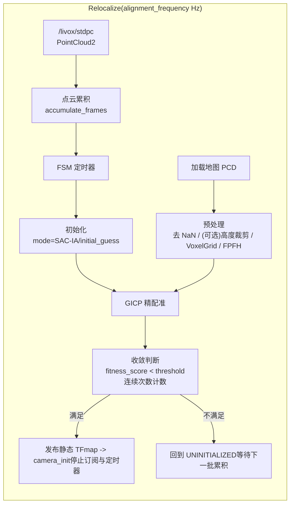

# BIT icp_relocalization
## DreamChaser

`icp_relocalization` 是一个面向激光点云的 **ROS2 重定位节点**（SAC-IA + GICP）：
- 离线加载地图点云（PCD），做降采样与 FPFH 特征预处理。
- 运行期累积激光点云，使用 **SAC-IA（可选）** 做粗配准、使用 **GICP** 做精配准。
- 连续满足收敛条件后，发布静态 TF（`map_frame -> cloud_frame_id`）并停止计算以节省算力；支持通过服务重新触发重定位。

> 节点：`gicp_relocalization_node`（可执行文件 `gicp_node`）。

---

## 1. 功能包简介

1) **地图侧预处理（离线）**
- 输入：`target_pcd_file` 指定的地图 PCD。
- 处理：去 NaN →（可选）高度裁剪 → VoxelGrid 下采样 → 法线 + FPFH。

2) **在线重定位（运行期）**
- 输入：`/livox/stdpc` 点云流（可通过 remap 适配你的点云话题）。
- 处理：累积 `accumulate_frames` 帧后触发一次对齐；根据 `mode` 使用 SAC-IA 或初始位姿作为初值；再用 GICP 精配准。

3) **输出**
- 静态 TF：`map_frame -> cloud_frame_id`（`cloud_frame_id` 来自点云 header 的 `frame_id`）。
- Debug 点云：地图、累积源点云、对齐后点云。

---

## 2. Mermaid 流程图（算法与数据流）



---

## 3. 算法工作流程

### 3.1 地图预处理（`GicpFilter::preprocessMap`）

1) 移除 NaN 点
2) 可选高度滤波（PassThrough on `z`）
3) VoxelGrid 下采样（地图侧 `gicp.target_voxel_leaf_size`）
4) 法线估计 + FPFH 特征（`feature_k_search`）

### 3.2 初始化对齐（SAC-IA 或初值模式）

两种模式由 `mode` 控制：

1) `mode: sac_ia`
- 在 `INITIALIZING` 状态执行 `GicpFilter::initialAlign()`：
    - 源点云（累积后）同样做（可选）高度滤波与 VoxelGrid 下采样
    - 计算源点云 FPFH
    - SAC-IA 得到粗变换
    - 以 SAC-IA 结果作为初值进入一次 GICP 精配准

2) `mode: initial_guess`
- 在 `UNINITIALIZED` 状态直接把 `initial_pose=[x,y,z,roll,pitch,yaw]` 转为初始矩阵（`map -> cloud_frame_id`），进入 `CONVERGING`。

### 3.3 GICP 精配准与收敛确认（`GicpFilter::align` + FSM）

1) 每次取一批累积点云作为 `source_cloud`
2) 以当前 `map_to_camera_init_` 作为 `initial_guess` 运行 GICP
3) 若 `converged && fitness_score < fitness_score_threshold`，`converged_count_++`
4) 连续达到 `converged_count_threshold`：
- 发布静态 TF：`map_frame -> cloud_frame_id`
- 取消 FSM timer，并 `reset()` 激光订阅，停止后续计算

---

## 4. Visualizer 简介（可视化与验配）

该包主要通过点云话题来辅助验配：
- `/gicp_map`：地图点云（transient_local，RViz 打开后能立刻看到）
- `/gicp_source`：累积后的源点云（Debug）
- `/gicp_aligned`：将源点云用当前估计变换到 `map_frame` 后的点云（用于直观看配准效果）

---

## 5. 参数配置说明

所有参数挂在节点名 `gicp_relocalization_node.ros__parameters` 下；默认示例见 `config/gicp_relocalization.yaml`。

### 5.1 通用参数

| 参数 | 类型 | 默认值 | 说明 |
|---|---:|---:|---|
| `mode` | string | `sac_ia` | `sac_ia`：先粗后精；`initial_guess`：用 `initial_pose` 作为初值。 |
| `target_pcd_file` | string | `map.pcd` | 地图点云 PCD 路径（建议用绝对路径或工作区相对路径）。 |
| `map_frame` | string | `map` | 发布静态 TF 的父坐标系。 |
| `alignment_frequency` | double | 1.0 | FSM 执行频率（Hz）。 |
| `accumulate_frames` | int | 5 | 每次参与配准的累积帧数。 |
| `fitness_score_threshold` | double | 0.5 | 配准得分阈值（越小越严格）。 |
| `converged_count_threshold` | int | 5 | 连续满足阈值的次数。 |
| `initial_pose` | double[6] | `[0,0,0,0,0,0]` | 初始位姿（仅 `mode=initial_guess` 使用）。 |
| `feature_k_search` | int | 20 | 法线/FPFH 邻域 K 值。 |

### 5.2 高度滤波（可选性能优化）

| 参数 | 类型 | 默认值 | 说明 |
|---|---:|---:|---|
| `height_filter.enable` | bool | `false` | 是否启用 PassThrough（`z`）。 |
| `height_filter.min_z` | double | -1000.0 | 最小 z。 |
| `height_filter.max_z` | double | 1000.0 | 最大 z。 |

### 5.3 GICP 参数

| 参数 | 类型 | 默认值 | 说明 |
|---|---:|---:|---|
| `gicp.target_voxel_leaf_size` | double | 0.1 | 地图点云体素滤波分辨率。 |
| `gicp.source_voxel_leaf_size` | double | 0.1 | 源点云体素滤波分辨率。 |
| `gicp.max_correspondence_distance` | double | 1.5 | 最大对应距离。 |
| `gicp.max_iterations` | int | 100 | 最大迭代次数。 |
| `gicp.transformation_epsilon` | double | 1e-4 | 变换收敛阈值。 |
| `gicp.euclidean_fitness_epsilon` | double | 1e-4 | 适应度收敛阈值。 |

### 5.4 SAC-IA 参数（`mode=sac_ia` 时使用）

| 参数 | 类型 | 默认值 | 说明 |
|---|---:|---:|---|
| `sac_ia.min_sample_distance` | double | 0.5 | 采样最小间距。 |
| `sac_ia.correspondence_randomness` | int | 6 | 对应随机性。 |
| `sac_ia.num_samples` | int | 3 | 采样点数。 |
| `sac_ia.max_correspondence_distance` | double | 1.0 | 最大对应距离。 |

---

## 6. 依赖与安装

### 6.1 主要依赖

- PCL：`pcl_ros`、`pcl_conversions`
- Eigen3、OpenMP
- TF2：`tf2_ros`、`tf2_eigen`
- ROS2 基础：`rclcpp`、`sensor_msgs`、`nav_msgs`、`geometry_msgs`、`std_srvs`

### 6.2 编译

```bash
colcon build --packages-select icp_relocalization --cmake-args -DCMAKE_BUILD_TYPE=Release
```

运行前加载环境：

```bash
source install/setup.bash
```

### 6.3 启动与话题适配

启动（launch 会包含 `msg_convert` 的 livox 转换）：

```bash
ros2 launch icp_relocalization gicp_relocalization.launch.py 
```

---

## 7. 测试效果展示

- **RViz 验配截图 / 对齐前后对比（占位）**

<table>
    <tr>
        <td align="center">
            
        </td>
        <td align="center">
            
        </td>
    </tr>
</table>

---

## 8. 常见问题

- `fitness_score` 一直很高：尝试增大 `gicp.max_correspondence_distance`、增大体素分辨率（leaf size 更大 → 点更少）、或启用 `height_filter` 去掉地面/天花板干扰。
- `mode=sac_ia` 初始化不稳定：提高 `accumulate_frames`，适当增大 `sac_ia.max_correspondence_distance`，确保地图与在线点云尺度/坐标系一致。
- TF 没发布：需要达到连续收敛阈值；同时 `cloud_frame_id` 来自输入点云 header 的 `frame_id`，上游转换节点要填对。
