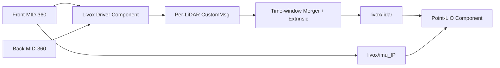

# 📡 Livox ROS Driver 2 · Project Integration

> Livox MID-360 的 ROS 2 驱动与项目集成说明：涵盖主机/雷达 IP、单/双雷达 topic、时间窗融合、外参以及与 Point-LIO 的进程内部署。

[返回项目主页](../../../README.md) · [Point-LIO](../Point-LIO/README.md)

## ✨ 本仓库集成特性

本目录基于 Livox ROS Driver 2，并针对哨兵感知链路增加/整合：

- ROS 2 Component 方式加载驱动。
- 双 MID-360 独立接收与内部点云融合。
- 按时间窗对前后雷达帧配对，应用外参后发布统一 `CustomMsg`。
- `CustomMsg::UniquePtr` 移动发布，为同容器 intra-process 传输提供条件。
- 驱动与 Point-LIO 同置于 `component_container_mt`，减少大点云 DDS 序列化开销。
- 保留逐雷达 IMU topic，由 Point-LIO 选择主雷达 IMU。

## 🔄 模块流程图



### 流程概述

SDK 回调按设备 IP 接收两台 MID-360 数据，保留逐雷达点云/IMU topic。内部 merger 按 front/back IP 选择两路点云，在允许时间窗内配对，将后雷达点按 `back → front` 外参变换后组成统一 `livox/lidar`。融合消息以 `UniquePtr` 发布给同容器 Point-LIO；驱动不负责 LIO 去畸变、状态估计或世界系变换。

## 🧪 技术方向

- SDK 网络层负责发现设备、接收 packet，并按 IP 区分点云和 IMU。
- 双雷达融合在驱动侧完成时间窗配对与刚体变换，Point-LIO 只消费统一点云和选定主雷达 IMU。
- `multi_topic: 1` 保留来源信息，是当前 front/back merger 选择设备的前提。
- 外参方向、时间窗和主 IMU topic 是跨 Driver/Point-LIO 的共同契约。

## ⚡ 性能方向

- 融合 `CustomMsg`/`PointCloud2` 通过 `std::unique_ptr` 构造并 `publish(std::move(...))`，避免驱动内部完整消息复制。
- Driver 与 Point-LIO 同置 `component_container_mt` 并启用 intra-process，减少点云 DDS 序列化；是否真正少拷贝仍取决于发布/订阅类型和 QoS 兼容。
- 合并频率和时间窗需要在双雷达完整性、运动畸变与下游算力之间权衡，不能只追求更高频率。
- 本模块当前没有与 Planner/ROGMap/MPC 同型的 CSV `PerformanceMonitor`；网络/融合性能主要通过 topic 频率、时间戳和下游 Point-LIO 统计观察，文档不把它误写为已具备统一 CSV。

## 🌐 网络配置

主配置文件：

- `config/mixed_MID360_config.json`：SDK 网络与雷达列表。
- `config/mixed_MID360_component.yaml`：ROS 2 驱动、融合与外参参数。

当前典型网络：

| 设备 | IP |
|---|---|
| 主机网卡 | `192.168.1.47` |
| 前雷达 | `192.168.1.135` |
| 后雷达 | `192.168.1.122` |

JSON 中还配置主机接收端口（点云、IMU、命令、日志等）。换车或换网卡时，至少同步检查：

1. 主机静态 IP 与 `host_net_info` 一致。
2. 雷达 IP 与 JSON `lidar_configs` 一致。
3. 主机与雷达处于同一子网，且没有 IP 冲突。
4. 防火墙未阻止 UDP 数据端口。
5. 网卡 MTU、节能与多网卡路由没有把数据导向错误接口。

Linux 临时配置示例（网卡名按实机替换）：

```bash
sudo ip addr add 192.168.1.47/24 dev eth0
sudo ip link set eth0 up
ping 192.168.1.135
ping 192.168.1.122
```

## ⚙️ ROS 与融合参数

`mixed_MID360_component.yaml` 当前关键项：

| 参数 | 当前典型值 | 说明 |
|---|---:|---|
| `xfer_format` | `1` | 发布 Livox `CustomMsg` |
| `multi_topic` | `1` | 每台雷达保留独立 topic |
| `publish_freq` | `20.0` | 驱动发布频率 |
| `frame_id` | `livox_frame` | 原始点云 frame |
| `enable_internal_lidar_merge` | `true` | 开启驱动内双雷达融合 |
| `merge_front_ip` | `192.168.1.135` | 前雷达选择 |
| `merge_back_ip` | `192.168.1.122` | 后雷达选择 |
| `merge_output_topic` | `livox/lidar` | Point-LIO 主输入 |
| `merge_max_interval_ms` | `5.0` | 两雷达帧允许的最大时间差 |

`multi_topic: 1` 是融合链路的重要前提：驱动先生成可区分来源的逐雷达消息，内部 merger 再选择指定 IP 的前/后雷达进行组合。

## 📐 双雷达外参

融合参数中的外参描述后雷达点转换到前雷达/融合参考系的刚体变换。当前配置形如：

```yaml
merge_extrinsic_back_to_front: [0.0, 0.4, 0.0, -0.35453, 0.0, 0.0]
```

六个值的顺序以当前 merger 参数解析源码为准，通常包含 xyz 平移与 rpy 旋转。修改前必须：

1. 确认角度单位是弧度。
2. 确认变换方向是 `back → front`，不要直接填反变换。
3. 用静态墙面检查两雷达重合，而不是只观察室外稀疏点。
4. 将“雷达间外参”与 Point-LIO 的“主雷达–IMU 外参”分开标定。

错误外参会在融合消息进入 LIO 前产生双墙、地面分层和旋转中心异常。

## 📡 Topic 约定

| Topic | 来源 / 用途 |
|---|---|
| `livox/lidar` | 双雷达融合后的 `CustomMsg`，Point-LIO 主输入 |
| `livox/imu_192_168_1_135` | 前雷达 IMU，当前 Point-LIO 输入 |
| 逐雷达 lidar topic | merger 内部输入与独立诊断；具体名称由驱动 IP 规则生成 |
| 逐雷达 IMU topic | 每台 MID-360 独立发布 |

修改 `merge_front_ip` 后，Point-LIO 的 `common.imu_topic` 也应随主 IMU topic 更新。

## 🚀 启动方式

### 推荐：Driver + Point-LIO 同容器

```bash
ros2 launch point_lio mixed_livox_pointlio_intra_process.launch.py
```

该入口使用多线程组件容器并开启 intra-process，是项目主感知链路的推荐方式。

### 驱动独立调试

```bash
ros2 launch livox_ros_driver2 msg_mixed_MID360.launch.py
```

独立 launch 的发布频率与 debug 开关可能不同于比赛集成 YAML，诊断结果应以实际加载参数为准，不要把调试配置直接当作比赛配置。

## ✅ 启动后检查

```bash
ros2 component list
ros2 topic list | grep livox
ros2 topic hz livox/lidar
ros2 topic hz livox/imu_192_168_1_135
ros2 topic info livox/lidar --verbose
```

建议先分别确认两台雷达均在线，再检查融合 topic；否则单雷达掉线可能被误判为 Point-LIO 或地图故障。

## ⚡ 性能说明

- `UniquePtr` 发布避免在驱动内部无意义复制完整 `CustomMsg`。
- 同一组件容器和 intra-process 使驱动到 Point-LIO 可以绕过常规 DDS 序列化路径。
- 多线程容器允许雷达、IMU 与 LIO 回调并发，但仍需避免高频 debug 输出。
- `max_merge_interval_ms` 越小，双雷达时间一致性越好，但在抖动或丢包时更容易缺帧；越大则运动场景空间误差更明显。
- 不应为了“数据更多”盲目提高发布频率，需同时考虑 LIO、ROGMap 和 CPU 调度能力。

## ⚠️ 已知问题与改进方向

- 双雷达时间窗融合依赖两路 packet 到达抖动；时间窗过窄会缺帧，过宽会在高速运动中放大时差造成的空间错位。
- 同容器中的未捕获异常会影响整个组件进程；Driver、Point-LIO 与加载到同一容器的其他组件需要分别保留故障定位证据。
- 当前 driver publisher 主要使用配置的 queue depth，没有为所有点云/IMU topic 统一声明 latest-state QoS。诊断 QoS 时应以 `ros2 topic info --verbose` 和实际 publisher 源码为准。
- 驱动没有统一 CSV 性能记录类；后续若增加统计，应优先聚合 packet 间隔、两雷达配对差、merge 丢弃和发布耗时，避免逐 packet 同步刷盘。

## 🛠️ 常见问题

| 现象 | 优先检查 |
|---|---|
| 两台雷达都无数据 | 主机静态 IP、JSON host IP、网卡与防火墙 |
| 仅一台雷达在线 | 雷达 IP、供电、JSON 列表与网线 |
| 有独立 topic、无融合 topic | merger 开关、front/back IP、最大时间窗 |
| 点云出现双墙 | `back_to_front_extrinsic` 方向、单位和标定 |
| Point-LIO 无 IMU | IMU topic 是否包含正确主雷达 IP |
| intra-process 未生效 | 是否同一容器、双方是否使用兼容的 UniquePtr 接口 |
| 延迟周期性升高 | debug 日志、CPU 绑核/调度、丢包和订阅队列 |

## 🗂️ 关键文件

- `config/mixed_MID360_config.json`：SDK 网络与设备列表。
- `config/mixed_MID360_component.yaml`：组件与双雷达融合参数。
- `../Point-LIO/launch/mixed_livox_pointlio_intra_process.launch.py`：推荐集成入口。
- `launch_ROS2/msg_mixed_MID360.launch.py`：驱动独立调试入口。
- `src/`：驱动节点、消息发布与内部 merger 实现。

## 📄 上游与许可证

本目录包含 Livox 官方驱动衍生代码。使用、分发和修改时，请同时遵守本仓库根目录许可证以及本目录/上游代码中保留的许可证与版权声明。

## 📚 延伸阅读

LIO 参数、盲区中心与稠密点云发布见 [Point-LIO 文档](../Point-LIO/README.md)；完整系统安装与启动顺序见[项目主 README](../../../README.md)。
